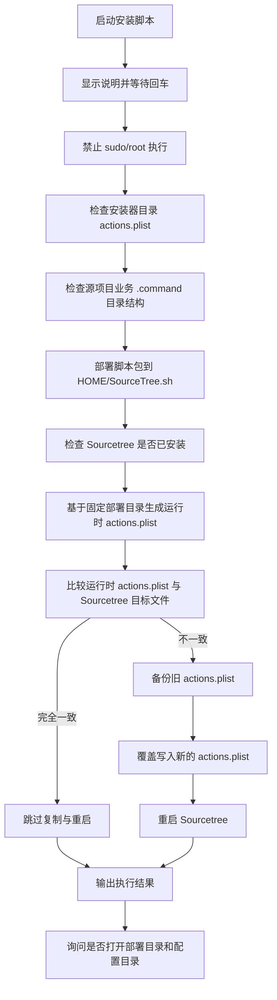

# `【MacOS】安装SourceTree自定义菜单.command`


[toc]

---

## 🔥 <font id=前言>前言</font> <a href="#🔚" style="font-size:17px; color:green;"><b>🔽</b></a>

这个脚本用于安装 [**Sourcetree**](https://www.sourcetreeapp.com/) 自定义菜单配置。

它不是单纯复制一个 `actions.plist`，而是会先把当前脚本包部署到当前用户目录下的固定位置，再基于固定路径生成运行时 `actions.plist`，最后写入 Sourcetree 的配置目录。这样做的目的，是避免 Sourcetree 菜单指向临时解压目录、桌面目录、下载目录或当前代码目录，导致后续菜单失效。

固定部署目录：

```shell
${HOME}/SourceTree.sh
```

Sourcetree 自定义菜单配置文件：

```shell
${HOME}/Library/Application Support/SourceTree/actions.plist
```

---

## 一、适用场景 <a href="#前言" style="font-size:17px; color:green;"><b>🔼</b></a> <a href="#🔚" style="font-size:17px; color:green;"><b>🔽</b></a>

- 已经整理好一套 Sourcetree 自定义菜单脚本，希望一键安装到当前 Mac 用户环境。
- 希望 Sourcetree 菜单里的脚本路径稳定指向 `${HOME}/SourceTree.sh`，而不是临时目录。
- 需要把多个业务 `.command` 脚本以统一结构部署，并同步写入 Sourcetree 的 `actions.plist`。
- 适合从压缩包、仓库目录或本地脚本包中执行安装。

---

## 二、目录结构要求 <a href="#前言" style="font-size:17px; color:green;"><b>🔼</b></a> <a href="#🔚" style="font-size:17px; color:green;"><b>🔽</b></a>

### 2.1、推荐结构

脚本包建议保持下面这种结构：

```text
SourceTree.sh/
├── 业务脚本A.command/
│   ├── 业务脚本A.command
│   └── README.md
├── 业务脚本B.command/
│   ├── 业务脚本B.command
│   └── README.md
├── 【MacOS】安装SourceTree自定义菜单.command/
│   ├── 【MacOS】安装SourceTree自定义菜单.command
│   ├── actions.plist
│   └── README.md
└── assets/
    └── 可选资源文件
```

### 2.2、安装器目录

当前脚本所在目录是安装器目录，目录内必须至少包含：

```text
【MacOS】安装SourceTree自定义菜单.command/
├── 【MacOS】安装SourceTree自定义菜单.command
├── actions.plist
└── README.md
```

其中：

| 文件 | 作用 |
| --- | --- |
| `【MacOS】安装SourceTree自定义菜单.command` | 安装入口脚本 |
| `actions.plist` | Sourcetree 自定义菜单模板 |
| `README.md` | 双击执行前阅读说明 |

### 2.3、业务脚本目录

除了安装器目录外，其它业务脚本目录必须满足：

```text
脚本名.command/
├── 脚本名.command
└── README.md
```

脚本会校验每个业务 `.command` 独立文件夹中是否存在同名脚本。若缺少同名脚本，会直接终止；若缺少 `README.md`，会警告但继续。

---

## 三、执行前检查 <a href="#前言" style="font-size:17px; color:green;"><b>🔼</b></a> <a href="#🔚" style="font-size:17px; color:green;"><b>🔽</b></a>

执行前请确认：

| 检查项 | 要求 |
| --- | --- |
| 当前用户 | 使用普通用户执行，不要使用 `sudo` |
| Sourcetree | 已安装 Sourcetree；未安装时脚本会引导打开官网 |
| `actions.plist` | 必须和安装脚本位于同一目录 |
| 业务脚本 | 每个业务 `.command` 文件夹内必须有同名 `.command` 文件 |
| [**Python**](https://www.python.org) | 系统需要能找到 `python3`，用于安全改写 `actions.plist` |
| 权限 | 当前用户需要能写入 `${HOME}/SourceTree.sh` 和 Sourcetree 配置目录 |

不要使用下面这种方式运行：

```shell
sudo ./"【MacOS】安装SourceTree自定义菜单.command"
```

原因很直接：使用 `sudo` 后，`HOME` 可能变成 `/var/root`，脚本会把菜单部署到错误用户目录。

---

## 四、运行方式 <a href="#前言" style="font-size:17px; color:green;"><b>🔼</b></a> <a href="#🔚" style="font-size:17px; color:green;"><b>🔽</b></a>

### 4.1、双击运行

在 Finder 中双击：

```text
【MacOS】安装SourceTree自定义菜单.command
```

脚本会先显示执行说明，按回车继续，按 `Ctrl+C` 取消。

### 4.2、终端运行

进入安装脚本所在目录后执行：

```shell
chmod +x "./【MacOS】安装SourceTree自定义菜单.command"
./"【MacOS】安装SourceTree自定义菜单.command"
```

也可以直接用 `zsh` 执行：

```shell
zsh "./【MacOS】安装SourceTree自定义菜单.command"
```

---

## 五、脚本执行流程 <a href="#前言" style="font-size:17px; color:green;"><b>🔼</b></a> <a href="#🔚" style="font-size:17px; color:green;"><b>🔽</b></a>

脚本主流程如下：



---

## 六、脚本具体会做什么 <a href="#前言" style="font-size:17px; color:green;"><b>🔼</b></a> <a href="#🔚" style="font-size:17px; color:green;"><b>🔽</b></a>

### 6.1、部署脚本包

脚本会把源项目根目录下的业务 `.command` 文件夹复制到：

```shell
${HOME}/SourceTree.sh
```

同时会复制当前安装器目录到：

```shell
${HOME}/SourceTree.sh/【MacOS】安装SourceTree自定义菜单.command
```

如果源项目根目录存在 `assets` 目录，也会同步到：

```shell
${HOME}/SourceTree.sh/assets
```

根目录下的普通文件也会复制到 `${HOME}/SourceTree.sh`。

### 6.2、生成运行时 `actions.plist`

脚本不会直接把模板 `actions.plist` 原样写入 Sourcetree，而是会用 `python3` 读取模板，扫描固定部署目录里的业务 `.command` 脚本，并把模板里旧的脚本路径改写成固定部署目录下的真实路径。

例如模板里引用：

```text
/某个临时目录/同步代码.command
```

运行时会被改写成类似：

```text
/Users/jobs/SourceTree.sh/同步代码.command/同步代码.command
```

这里的 `/Users/jobs` 会随当前用户的 `${HOME}` 自动变化。

### 6.3、写入 Sourcetree 配置

目标配置文件是：

```shell
${HOME}/Library/Application Support/SourceTree/actions.plist
```

如果目标文件不存在，脚本会直接复制。

如果目标文件存在且内容不同，脚本会先备份：

```text
actions.plist.bak.年月日_时分秒
```

然后再覆盖写入新的 `actions.plist`。

如果目标文件和运行时文件完全一致，脚本会跳过复制，也不会重启 Sourcetree。

### 6.4、重启 Sourcetree

只有当 `actions.plist` 发生实际替换时，脚本才会重启 Sourcetree。

重启策略：

1. 优先通过 AppleScript 优雅退出。
2. 等待进程退出。
3. 若长时间未退出，再尝试强制结束进程。
4. 最后重新启动 Sourcetree。

---

## 七、关键路径说明 <a href="#前言" style="font-size:17px; color:green;"><b>🔼</b></a> <a href="#🔚" style="font-size:17px; color:green;"><b>🔽</b></a>

| 路径 | 说明 |
| --- | --- |
| `${HOME}/SourceTree.sh` | 固定部署目录 |
| `${HOME}/SourceTree.sh/【MacOS】安装SourceTree自定义菜单.command` | 安装器部署目录 |
| `${HOME}/Library/Application Support/SourceTree` | Sourcetree 配置目录 |
| `${HOME}/Library/Application Support/SourceTree/actions.plist` | Sourcetree 自定义菜单配置 |
| `/tmp/【MacOS】安装SourceTree自定义菜单.log` | 本脚本日志文件 |

---

## 八、日志文件 <a href="#前言" style="font-size:17px; color:green;"><b>🔼</b></a> <a href="#🔚" style="font-size:17px; color:green;"><b>🔽</b></a>

脚本会把终端输出同步写入日志文件：

```shell
/tmp/【MacOS】安装SourceTree自定义菜单.log
```

如果执行失败，优先查看这个日志文件。

常用查看命令：

```shell
cat "/tmp/【MacOS】安装SourceTree自定义菜单.log"
```

或实时查看：

```shell
tail -f "/tmp/【MacOS】安装SourceTree自定义菜单.log"
```

---

## 九、常见问题 <a href="#前言" style="font-size:17px; color:green;"><b>🔼</b></a> <a href="#🔚" style="font-size:17px; color:green;"><b>🔽</b></a>

### 9.1、提示 `请不要使用 sudo/root 执行本脚本`

不要加 `sudo`。重新用当前普通用户执行：

```shell
./"【MacOS】安装SourceTree自定义菜单.command"
```

### 9.2、提示找不到 `actions.plist`

说明安装脚本同目录下缺少模板文件。请确认结构是：

```text
【MacOS】安装SourceTree自定义菜单.command/
├── 【MacOS】安装SourceTree自定义菜单.command
└── actions.plist
```

### 9.3、提示未发现任何业务 `.command` 独立文件夹

说明源项目根目录下没有符合结构的业务脚本目录。

正确结构示例：

```text
SourceTree.sh/
├── 某业务脚本.command/
│   ├── 某业务脚本.command
│   └── README.md
└── 【MacOS】安装SourceTree自定义菜单.command/
    ├── 【MacOS】安装SourceTree自定义菜单.command
    └── actions.plist
```

### 9.4、提示未找到 `python3`

脚本需要 `python3` 来安全读写 `actions.plist`。可以先安装 [**Xcode**](https://developer.apple.com/xcode) Command Line Tools：

```shell
xcode-select --install
```

也可以通过 [**Homebrew**](https://brew.sh/) 安装 Python：

```shell
brew install python
```

### 9.5、Sourcetree 菜单没有变化

优先检查：

1. 脚本是否提示 `actions.plist 与目标文件完全一致`。
2. Sourcetree 是否已重启。
3. 目标文件是否写入：

   ```shell
   ls -l "${HOME}/Library/Application Support/SourceTree/actions.plist"
   ```

4. 日志文件中是否有路径改写失败、脚本缺失或权限失败提示。

---

## 十、风险说明 <a href="#前言" style="font-size:17px; color:green;"><b>🔼</b></a> <a href="#🔚" style="font-size:17px; color:green;"><b>🔽</b></a>

这个脚本会修改当前用户环境，执行前要知道它的影响范围。

| 风险点 | 说明 |
| --- | --- |
| 覆盖部署目录 | 会复制/覆盖 `${HOME}/SourceTree.sh` 下同名脚本文件夹和安装器目录 |
| 改写菜单配置 | 会写入 `${HOME}/Library/Application Support/SourceTree/actions.plist` |
| 自动备份 | 覆盖前会备份旧 `actions.plist`，但仍属于配置替换操作 |
| 自动重启 | 仅当 `actions.plist` 实际变化时，会自动重启 Sourcetree |
| 路径绑定 | 菜单最终会绑定到 `${HOME}/SourceTree.sh` 下的脚本，不再指向源目录 |

脚本不会主动删除 `${HOME}/SourceTree.sh` 里的额外文件，但会覆盖同名业务脚本文件夹、安装器目录和根目录同名文件。

---

## 十一、验证方式 <a href="#前言" style="font-size:17px; color:green;"><b>🔼</b></a> <a href="#🔚" style="font-size:17px; color:green;"><b>🔽</b></a>

执行前可以先做语法检查：

```shell
zsh -n "./【MacOS】安装SourceTree自定义菜单.command"
```

执行后可以检查固定部署目录：

```shell
find "${HOME}/SourceTree.sh" -maxdepth 2 -type f
```

检查 Sourcetree 配置文件：

```shell
plutil -p "${HOME}/Library/Application Support/SourceTree/actions.plist"
```

检查日志：

```shell
cat "/tmp/【MacOS】安装SourceTree自定义菜单.log"
```

---

## 十二、未执行声明 <a href="#前言" style="font-size:17px; color:green;"><b>🔼</b></a> <a href="#🔚" style="font-size:17px; color:green;"><b>🔽</b></a>

当前 README 仅根据 `【MacOS】安装SourceTree自定义菜单.command` 的脚本内容编写。

未在本机实际执行以下有副作用操作：

```shell
./"【MacOS】安装SourceTree自定义菜单.command"
```

也未实际写入：

```shell
${HOME}/SourceTree.sh
${HOME}/Library/Application Support/SourceTree/actions.plist
```

正式执行前，建议先确认脚本包目录结构完整，再运行语法检查。

---

<a id="🔚" href="#前言" style="font-size:17px; color:green; font-weight:bold;">我是有底线的➤点我回到首页</a>
