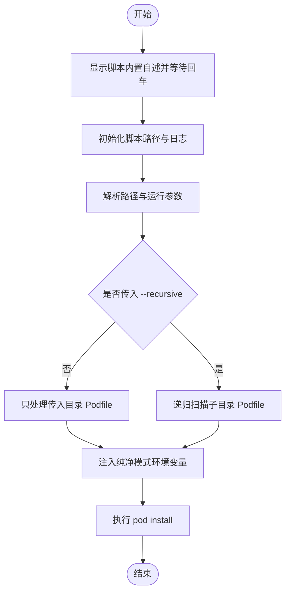

# `【MacOS@SourceTree】Pod_Install.command`


[toc]

## 🔥 <font id=前言>前言</font>

- 采用 Shell 脚本的原因：Shell 来自 [**macOS**](https://www.apple.com/macos/) 原生系统底层，虽然写法相对繁琐冗杂，但执行效率高，并且不需要额外介入 [**Ruby**](https://www.ruby-lang.org)、[**Python**](https://www.python.org) 等第三方运行环境，因此具备更好的移植性。

- 本自述文件对应脚本：`【MacOS@SourceTree】Pod_Install.command`。
- 脚本原始位置：`JobsGenesis@JobsCommand.SourceTree`。
- 脚本定位：用于 SourceTree 自定义操作入口。
- 脚本运行策略：兼容系统终端双击运行和 Sourcetree 自定义动作运行，按实际环境决定是否启用完整终端交互。
- 默认执行范围：只对传入目录本身执行一次 `pod install --no-repo-update`，不递归扫描子目录，避免第三方示例工程被误处理。
- 默认纯净策略：自动注入 `JOBS_POD_INSTALL_PURE=1`，让工程 `Podfile` 跳过依赖报告、CodeGraph 索引等可选外部增强脚本。
- 手动扩展策略：需要递归处理子目录时传 `--recursive`；需要允许 `Podfile` 可选外部增强脚本时传 `--with-hooks`。
- 已兼容 Sourcetree 自定义动作的瘦身环境：缺失 `TERM`、`$0` 不是绝对路径、非交互输入、ANSI 彩色码无法正确渲染时自动降级为纯文本输出。
- 普通安装 / 更新 / 升级交互统一为：**回车跳过，输入任意字符后回车执行**。
- 危险操作不应该靠回车默认执行；涉及破坏性修改时，应单独输入 `YES` 确认。

## 一、脚本用途 <a href="#前言" style="font-size:17px; color:green;"><b>🔼</b></a> <a href="#🔚" style="font-size:17px; color:green;"><b>🔽</b></a>

| 项目 | 说明 |
|---|---|
| 脚本名称 | `【MacOS@SourceTree】Pod_Install.command` |
| 所属目录 | `JobsGenesis@JobsCommand.SourceTree` |
| 主要标签 | `SourceTree` |
| 是否涉及 Homebrew | `否` |
| 是否可能联网 | `是，pod install 可能下载依赖` |
| 是否含高风险命令 | `否` |
| 默认执行范围 | `仅传入目录本身，不递归` |
| 默认 Podfile 增强 | `纯净模式，跳过可选外部增强脚本` |
| zsh 静态检查 | `已执行 zsh -n，通过` |

## 二、运行方式 <a href="#前言" style="font-size:17px; color:green;"><b>🔼</b></a> <a href="#🔚" style="font-size:17px; color:green;"><b>🔽</b></a>

推荐双击 `.command` 运行。终端方式如下：

```shell
chmod +x './【MacOS@SourceTree】Pod_Install.command'
'./【MacOS@SourceTree】Pod_Install.command'
```

脚本启动后会先显示脚本内置自述，并等待回车继续，避免误触执行。
脚本默认只处理当前目录；如果需要递归扫描子目录 `Podfile`，追加 `--recursive`：

```shell
'./【MacOS@SourceTree】Pod_Install.command' /path/to/project --recursive
```

脚本默认启用纯净模式；如果需要执行 `Podfile` 中的可选外部增强脚本，追加 `--with-hooks`：

```shell
'./【MacOS@SourceTree】Pod_Install.command' /path/to/project --with-hooks
```

Sourcetree 自定义动作方式如下：

```shell
【MacOS@SourceTree】Pod_Install.command /path/to/project
```

在 Sourcetree 环境下，脚本会自动跳过 `clear` 和回车等待，并关闭 ANSI 彩色码，避免日志里出现 ANSI 转义码。

## 三、脚本运行策略 <a href="#前言" style="font-size:17px; color:green;"><b>🔼</b></a> <a href="#🔚" style="font-size:17px; color:green;"><b>🔽</b></a>

- 脚本使用 `#!/bin/zsh` 和 `main "$@"` 统一收口，先展示自述说明，再进入真实业务逻辑。
- 系统终端双击运行时，脚本保持完整终端体验：可清屏、可彩色输出、可等待用户回车确认。
- Sourcetree 自定义动作运行时，脚本会识别瘦身环境，自动跳过 `clear` 和回车等待，并关闭 ANSI 彩色码，避免日志里出现 ANSI 转义码。
- 脚本会兜底解析真实脚本路径，确保 Sourcetree 只传脚本名时仍能稳定定位当前脚本和日志。
- 脚本默认只执行传入目录本身的 `Podfile`；不会递归进入 `JobsByPods`、第三方 Pods、示例工程或子工作区。
- `--recursive` 是显式批量模式，会扫描子目录 `Podfile`，默认仍跳过 `.git`、`Pods`、`.dart_tool`、`build`、`DerivedData`。
- 纯净模式会给 `pod install` 注入 `JOBS_POD_INSTALL_PURE=1` 和 `JOBS_POD_INSTALL_SKIP_EXTERNAL_SCRIPTS=1`，由工程 `Podfile` 判断并跳过可选外部增强。
- `--with-hooks` 会关闭纯净模式，允许工程 `Podfile` 执行依赖报告、CodeGraph 后台索引等可选增强。
- 终端输出和日志同步落盘；排查时优先查看 README 中声明的 `/tmp/脚本名.log`。

## 四、Homebrew 标准 <a href="#前言" style="font-size:17px; color:green;"><b>🔼</b></a> <a href="#🔚" style="font-size:17px; color:green;"><b>🔽</b></a>

若脚本涉及 Homebrew，统一遵循下面的健康标准：

- 自动识别 `arm64` / `x86_64`。
- Apple Silicon 优先使用 `/opt/homebrew/bin/brew`。
- Intel 优先使用 `/usr/local/bin/brew`。
- 自动把 `brew shellenv` 写入当前 shell 对应配置文件。
- 当前会话立即 `eval "$({brew_bin} shellenv)"` 生效。
- 已安装时不强制升级，而是询问：**回车跳过，输入任意字符后回车升级**。
- 健康更新顺序为：`brew update` → `brew upgrade` → `brew cleanup` → `brew doctor` → `brew -v`。

## 五、注意事项 <a href="#前言" style="font-size:17px; color:green;"><b>🔼</b></a> <a href="#🔚" style="font-size:17px; color:green;"><b>🔽</b></a>

- 我没有在生成阶段执行脚本里的 macOS 专属命令，例如 `brew`、`pod`、`flutter`、`xcodebuild`、`osascript`、`sudo`、模拟器控制等。
- 首次运行前建议先阅读本 README，再执行脚本。
- 如果脚本涉及工程目录，请确认当前目录或拖入路径正确。
- 如果脚本涉及 [**Git**](https://github.com) / [**CocoaPods**](https://cocoapods.org/) / [**Flutter**](https://flutter.dev/) 依赖更新，建议先提交或备份本地改动。
- 运行日志默认写入：`/tmp/Pod_Install.log`。
- 如果在 Sourcetree 中看到 `Completed with errors`，以脚本最后的失败统计和 `/tmp/Pod_Install.log` 为准继续排查。

## 六、流程图 <a href="#前言" style="font-size:17px; color:green;"><b>🔼</b></a> <a href="#🔚" style="font-size:17px; color:green;"><b>🔽</b></a>



<a id="🔚" href="#前言" style="font-size:17px; color:green; font-weight:bold;">我是有底线的➤点我回到首页</a>
