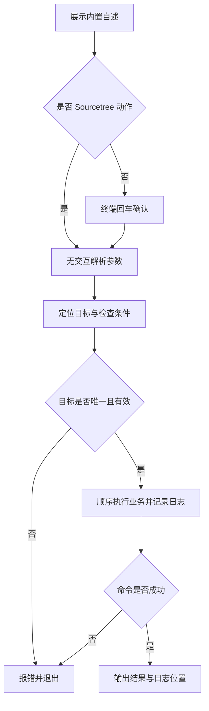

# `【MacOS@SourceTree】♻️修复Flutter项目中文路径.command`


[toc]

---

## 🔥 <font id=前言>前言</font>

这是 [**Sourcetree**](https://www.sourcetreeapp.com/) 的 [**Flutter**](https://flutter.dev/) 工程动作。将自有 Dart 文件中 `package:` 指令内的 URI 编码 Unicode 路径还原为 UTF-8 字符，并保存原始文件。

## 一、运行方式 <a href="#前言" style="font-size:17px; color:green;"><b>🔼</b></a> <a href="#🔚" style="font-size:17px; color:green;"><b>🔽</b></a>

在 Sourcetree 已安装的动作中传入 `$REPO`。系统终端独立运行先打印脚本内置自述，按回车继续，按 `Ctrl+C` 取消；运行时不读取 README。Sourcetree 身份通过环境变量或父进程确认，非 TTY 本身不会绕过确认。

```shell
zsh "./【MacOS@SourceTree】♻️修复Flutter项目中文路径.command" "<工程目录>"
```

接受一个可选工程路径；支持直接工程、工程内文件和唯一子工程。

自述与确认阶段只输出到屏幕；确认后才初始化日志。非 Sourcetree 且没有交互输入时直接退出，不执行工程业务。

## 二、执行前检查 <a href="#前言" style="font-size:17px; color:green;"><b>🔼</b></a> <a href="#🔚" style="font-size:17px; color:green;"><b>🔽</b></a>

使用 [**macOS**](https://www.apple.com/macos/) 自带 [**Perl**](https://www.perl.org/) 与核心 `Encode` 模块，不依赖第三方 URI 模块或 Python。

路径支持中文、空格和拖拽外层引号。需要递归定位的工程动作会排除依赖、缓存和构建目录；多个工程候选时应直接指定目标。

## 三、实际执行流程 <a href="#前言" style="font-size:17px; color:green;"><b>🔼</b></a> <a href="#🔚" style="font-size:17px; color:green;"><b>🔽</b></a>

整段解码连续 UTF-8 高位字节，避免逐字节解码造成中文替换字符。引号、斜杠和其他 ASCII 的百分号转义保持原样；无效 UTF-8 保持原样。只匹配以指令开头的行，不更改普通字符串或注释中的示例。

```shell
# 仅处理 lib/、test/、integration_test/ 内的 .dart 文件
# 支持单引号 / 双引号的 import、export、part package 指令
```

## 四、风险与失败处理 <a href="#前言" style="font-size:17px; color:green;"><b>🔼</b></a> <a href="#🔚" style="font-size:17px; color:green;"><b>🔽</b></a>

修改范围限于三处源码目录。跳过生成文件、明显由其他作者创建的文件、Pods / vendor / third_party / 缓存 / 构建目录以及旧备份。原文件按相对路径存入工程 `.import_backup/时间戳_进程号/`，重复运行不会覆盖上一次备份。

Sourcetree 不发起输入等待；无法安全确定目标或缺少必要条件时直接报错。外部命令失败返回非零状态，后续业务停止。脚本及外部输出在受限输出窗口使用纯文本。

## 五、日志与产物 <a href="#前言" style="font-size:17px; color:green;"><b>🔼</b></a> <a href="#🔚" style="font-size:17px; color:green;"><b>🔽</b></a>

执行日志位于系统临时目录，文件名为 `【MacOS@SourceTree】♻️修复Flutter项目中文路径.log`。终端和 Sourcetree 都会打印实际日志位置。

## 六、验证边界 <a href="#前言" style="font-size:17px; color:green;"><b>🔼</b></a> <a href="#🔚" style="font-size:17px; color:green;"><b>🔽</b></a>

已用隔离 Dart 夹具验证连续中文解码、单 / 双引号、import / export / part、无效 UTF-8 和 ASCII 转义保留、原文件备份、缓存与生成文件排除。

已通过 `zsh -n` 静态语法检查。 入口已隔离验证非交互拒绝、确认前不创建日志、`NO_COLOR` 空值降级与业务失败退出码传播。隔离夹具验证没有运行真实 Flutter / Xcode 构建、安装、依赖清理或模拟器操作；真实工程的签名、网络和工具版本仍需按运行日志确认。

## 七、流程图 <a href="#前言" style="font-size:17px; color:green;"><b>🔼</b></a> <a href="#🔚" style="font-size:17px; color:green;"><b>🔽</b></a>



<a id="🔚" href="#前言" style="font-size:17px; color:green; font-weight:bold;">我是有底线的➤点我回到首页</a>
