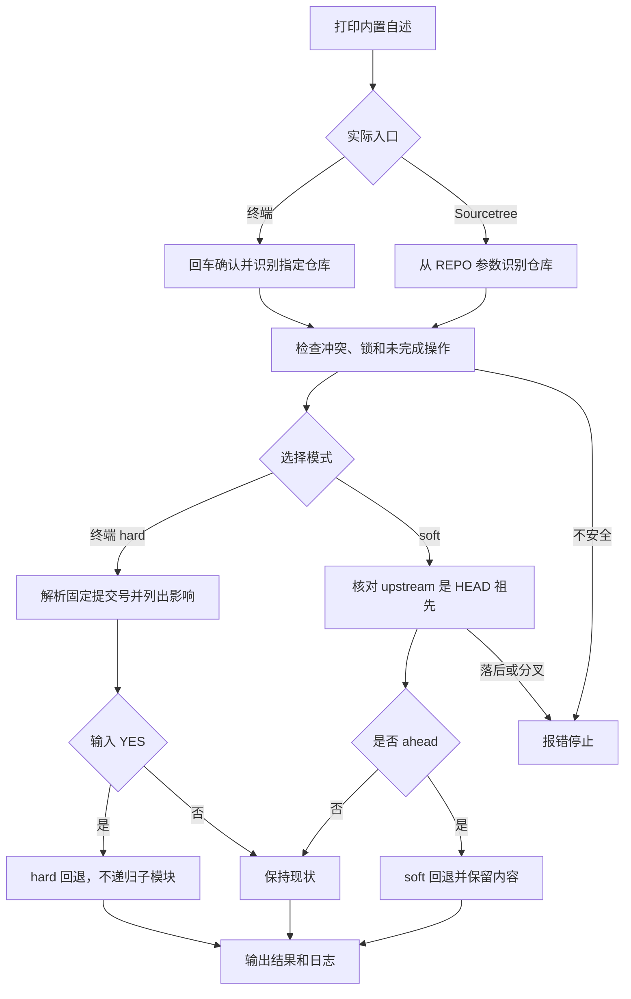

# `【MacOS@SourceTree】♻️双击Git（识别子Git） 提交回退.command`


[toc]

---

## 🔥 <font id=前言>前言</font>

> 将尚未推送的 [**Git**](https://git-scm.com/) 提交退回暂存区，或在终端中选择明确的历史提交执行回退。[**Sourcetree**](https://www.sourcetreeapp.com/) 自定义动作只执行保留内容的 `soft` 模式；破坏性的 `hard` 模式仅在终端输入 `YES` 后执行。

## 一、功能与运行边界 <a href="#前言" style="font-size:17px; color:green;"><b>🔼</b></a> <a href="#🔚" style="font-size:17px; color:green;"><b>🔽</b></a>

| 模式 | 目标 | 内容处理 |
| --- | --- | --- |
| soft 回退到 upstream | 当前分支已配置的远端跟踪快照 | 撤回本地 ahead 提交，工作区保留，对应内容进入暂存区 |
| hard 回退到 upstream | 同一远端跟踪快照 | 已跟踪的未提交内容被舍弃 |
| 选择提交 | 最近 200 条全分支提交记录 | 按完整提交号执行 hard 回退 |
| 选择 tag | 当前仓库标签 | 按 `refs/tags/<名称>` 解析后执行 hard 回退 |
| 选择 reflog | 最近 200 条本地 reflog 记录 | 按所选记录的完整提交号执行 hard 回退 |

- 终端可使用已有 [**fzf**](https://github.com/junegunn/fzf) 选择；未安装时改用原生编号输入。脚本不安装或升级软件，不写 Shell 配置。
- 回退只作用于选定 Git 工作树；不会递归扫描或重置子模块内部文件。
- 冲突、未完成的 merge / rebase / cherry-pick / revert / bisect、sequencer 或 `index.lock` 会阻止回退。
- 不提交、不推送、不执行 `clean`，不自动 Fetch。远端目标代表本地已有的跟踪快照，需要最新远端状态时应先在 Sourcetree Fetch 并核对。

## 二、运行方式 <a href="#前言" style="font-size:17px; color:green;"><b>🔼</b></a> <a href="#🔚" style="font-size:17px; color:green;"><b>🔽</b></a>

Sourcetree 动作传入 `$REPO`，打印内置自述后无交互执行 `soft`；缺少仓库路径直接失败，不猜测脚本所在仓库。

终端在当前 README 所在目录执行：

```shell
'./【MacOS@SourceTree】♻️双击Git（识别子Git） 提交回退.command' '/path/to/repository'
```

终端传入路径时仍先回车确认，再选择模式。不传路径时允许输入或拖入仓库目录；直接回车使用当前工作目录。按 `Ctrl+C` 可取消；选择界面按退出键或输入 `0` 取消。

`hard` 模式先显示仓库完整路径、目标说明和提交号，然后要求输入完整 `YES`。回车或其它输入均取消。取消后没有重置动作。

## 三、upstream 与 soft 的安全判据 <a href="#前言" style="font-size:17px; color:green;"><b>🔼</b></a> <a href="#🔚" style="font-size:17px; color:green;"><b>🔽</b></a>

1、优先采用当前分支的真实 `@{upstream}`，支持远端名和分支名均不同于 `origin/当前分支` 的配置。

2、当前分支未配置远端时，才尝试已有的 `origin/当前分支` 跟踪引用。已有配置却缺少引用时停止，不切换到另一条线路。

3、游离 HEAD、指向本地分支的 upstream 或无有效提交的远端跟踪引用不适用远端回退。

4、`soft` 只允许 upstream 提交是当前 HEAD 的祖先。没有 ahead 提交时保持现状；本地落后或分叉时失败，先 Fetch 并检查历史后再处理。

5、保留已有暂存和工作区修改；回退后先核对 `git diff --cached` 与 `git diff`，确认下一次提交的实际内容。

## 四、执行流程 <a href="#前言" style="font-size:17px; color:green;"><b>🔼</b></a> <a href="#🔚" style="font-size:17px; color:green;"><b>🔽</b></a>



## 五、风险、日志与验证 <a href="#前言" style="font-size:17px; color:green;"><b>🔼</b></a> <a href="#🔚" style="font-size:17px; color:green;"><b>🔽</b></a>

- `soft` 会移动当前分支 HEAD，原提交通常仍能通过 reflog 找到；它不是远端撤销动作。
- `hard` 会覆盖工作区的已跟踪内容，也可能清除挡住目标已跟踪路径的未跟踪文件或目录。请先留存需要的内容；`YES` 只是执行门禁，不提供内容备份。
- 日志位于系统临时目录的 `【MacOS@SourceTree】♻️双击Git（识别子Git） 提交回退.log`，含仓库、目标提交、执行结果和失败信息。
- 已在隔离临时仓库验证自定义 upstream 的 soft 回退、无 ahead 时保持原状、历史分叉/落后/未初始化分支停止、hard 空输入与 `y`/`NO` 取消、完整 `YES` 才执行，以及非交互确认门禁；脚本通过 `zsh -n`。没有对用户仓库执行回退，hard 的真实执行只发生在临时测试仓库。

<a id="🔚" href="#前言" style="font-size:17px; color:green; font-weight:bold;">我是有底线的➤点我回到首页</a>
