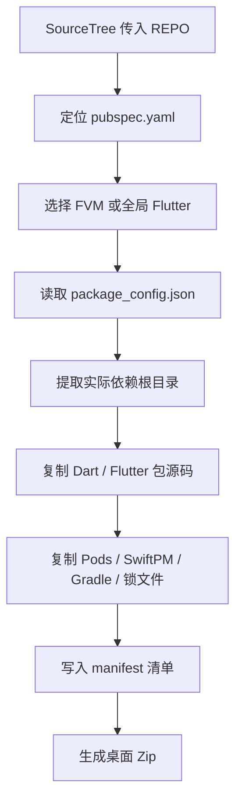

# `【MacOS@SourceTree】⚙️收集当前Flutter工程的依赖.command`


[toc]

---

## 🔥 <font id=前言>前言</font>

`【MacOS@SourceTree】⚙️收集当前Flutter工程的依赖.command` 是给 [**Sourcetree**](https://www.sourcetreeapp.com/) 自定义操作使用的 [**Flutter**](https://flutter.dev/) / [**Dart**](https://dart.dev) 依赖收集脚本。

从 Sourcetree 菜单执行时，脚本读取 `$REPO` 指向的当前仓库目录，定位 `pubspec.yaml`，解析 `.dart_tool/package_config.json`，把实际解析到的依赖源码、原生依赖目录和关键清单文件打包到桌面 Zip。

默认策略很克制：Sourcetree 模式不弹交互、不启用 `fzf`、不自动执行 `flutter pub get`。

---

## 一、适用场景 <a href="#前言" style="font-size:17px; color:green;"><b>🔼</b></a> <a href="#🔚" style="font-size:17px; color:green;"><b>🔽</b></a>

- 在 Sourcetree 里右键当前 Flutter 工程，一键收集工程实际依赖。
- 归档 `.pub-cache` 中当前工程解析到的 Dart / Flutter 包源码。
- 连同现有 `Pods`、SwiftPM 输出、`Podfile.lock`、`Package.resolved`、Gradle 声明文件一起打包。
- 排查离线环境、依赖版本、路径包、本地包和构建环境差异。

---

## 二、运行方式 <a href="#前言" style="font-size:17px; color:green;"><b>🔼</b></a> <a href="#🔚" style="font-size:17px; color:green;"><b>🔽</b></a>

### 2.1、Sourcetree 菜单运行

在 Sourcetree 自定义操作里选择：

```text
⚙️收集当前Flutter工程的依赖
```

菜单参数为：

```text
$REPO
```

脚本会无交互执行，输出完整日志，并在桌面生成：

```text
~/Desktop/工程名_flutter_deps_时间戳.zip
```

### 2.2、终端运行

```shell
zsh "./【MacOS@SourceTree】⚙️收集当前Flutter工程的依赖.command" "<flutter-root>_app"
```

可选参数：

| 参数 | 作用 |
| --- | --- |
| `<path-to>/app` | 指定 Flutter / Dart 工程根目录 |
| `-s`、`--select` | 使用 [**fzf**](https://formulae.brew.sh/formula/fzf) 多选 Dart / Flutter 依赖 |
| `--pub-get` | 执行 `flutter pub get` 刷新依赖解析文件 |
| `--no-pub-get` | 不执行 `flutter pub get`，直接使用现有解析文件 |
| `-h`、`--help` | 显示命令行帮助 |

---

## 三、执行前检查 <a href="#前言" style="font-size:17px; color:green;"><b>🔼</b></a> <a href="#🔚" style="font-size:17px; color:green;"><b>🔽</b></a>

- 当前仓库或传入目录必须能向上找到 `pubspec.yaml`。
- 工程必须已经存在 `.dart_tool/package_config.json`；Sourcetree 模式默认不会执行 `flutter pub get`。
- 系统必须能找到 `ruby`、`rsync`、`ditto`。
- Flutter 命令按下面优先级选择：

  | 优先级 | 命令来源 |
  | --- | --- |
  | 1 | 工程内 `.fvm/flutter_sdk/bin/flutter` |
  | 2 | 系统 [**fvm**](https://fvm.app) 的 `fvm flutter` |
  | 3 | 全局 `flutter` |

- 只有终端模式使用 `--select` 时才需要安装 `fzf`。

---

## 四、执行流程 <a href="#前言" style="font-size:17px; color:green;"><b>🔼</b></a> <a href="#🔚" style="font-size:17px; color:green;"><b>🔽</b></a>



---

## 五、风险说明 <a href="#前言" style="font-size:17px; color:green;"><b>🔼</b></a> <a href="#🔚" style="font-size:17px; color:green;"><b>🔽</b></a>

- Sourcetree 模式默认不修改工程依赖，只读取和复制文件。
- 终端模式显式传入 `--pub-get` 时，`flutter pub get` 可能更新 `.dart_tool`、`pubspec.lock` 或依赖解析结果。
- 压缩包大小取决于依赖规模和现有原生依赖目录，包含 `Pods` 时可能较大。
- 临时目录创建在 `$TMPDIR` 下，退出时只清理本次脚本创建的临时目录。

---

## 六、日志文件 <a href="#前言" style="font-size:17px; color:green;"><b>🔼</b></a> <a href="#🔚" style="font-size:17px; color:green;"><b>🔽</b></a>

日志路径：

```text
$TMPDIR/【MacOS@SourceTree】⚙️收集当前Flutter工程的依赖.log
```

失败时优先查看日志中的 `✖` 错误信息和对应路径。

---

## 七、验证边界 <a href="#前言" style="font-size:17px; color:green;"><b>🔼</b></a> <a href="#🔚" style="font-size:17px; color:green;"><b>🔽</b></a>

脚本可通过 `zsh -n` 做静态语法检查。真实依赖复制和压缩效果需要在具体 Flutter 工程中执行后确认。

<a id="🔚" href="#前言" style="font-size:17px; color:green; font-weight:bold;">我是有底线的➤点我回到首页</a>
