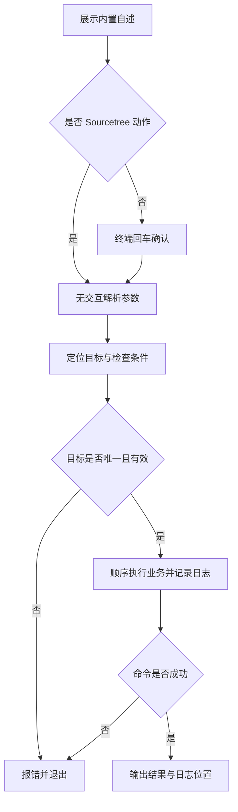

# `【MacOS@SourceTree】⚙️收集当前Flutter工程的依赖.command`


[toc]

---

## 🔥 <font id=前言>前言</font>

这是 [**Sourcetree**](https://www.sourcetreeapp.com/) 的 [**Flutter**](https://flutter.dev/) 工程动作。读取现有依赖解析，收集 Dart / Flutter 包源码、工程原生依赖和关键清单到桌面 Zip。

## 一、运行方式 <a href="#前言" style="font-size:17px; color:green;"><b>🔼</b></a> <a href="#🔚" style="font-size:17px; color:green;"><b>🔽</b></a>

在 Sourcetree 已安装的动作中传入 `$REPO`。系统终端独立运行先打印脚本内置自述，按回车继续，按 `Ctrl+C` 取消；运行时不读取 README。Sourcetree 身份通过环境变量或父进程确认，非 TTY 本身不会绕过确认。

```shell
zsh "./【MacOS@SourceTree】⚙️收集当前Flutter工程的依赖.command" "<工程目录>"
```

`[工程路径] [-s|--select] [--pub-get|--no-pub-get]`。默认所有入口都不执行 pub get；显式 `--pub-get` 在 Sourcetree 按参数执行，在终端按“回车跳过、任意字符执行”询问。Sourcetree 的 --select 自动降为全量收集。

自述与确认阶段只输出到屏幕；确认后才初始化日志。非 Sourcetree 且没有交互输入时直接退出，不执行工程业务。

## 二、执行前检查 <a href="#前言" style="font-size:17px; color:green;"><b>🔼</b></a> <a href="#🔚" style="font-size:17px; color:green;"><b>🔽</b></a>

需要 macOS `ruby`、`rsync`、`ditto` 以及可调用 Flutter SDK；使用 `--select` 还需要 [**fzf**](https://formulae.brew.sh/formula/fzf)。不自动安装工具。

路径支持中文、空格和拖拽外层引号。需要递归定位的工程动作会排除依赖、缓存和构建目录；多个工程候选时应直接指定目标。

## 三、实际执行流程 <a href="#前言" style="font-size:17px; color:green;"><b>🔼</b></a> <a href="#🔚" style="font-size:17px; color:green;"><b>🔽</b></a>

支持工程路径包含中文或空格，以及 Dart workspace 的上级 package_config。上级 workspace 解析文件和根 pubspec 也随包保留。包名、重复项、缺失依赖路径、非法 URI 都会明确失败；Ruby 解析 / rsync / ditto 失败不会伪报成功。相对 rootUri 按配置文件目录解析，不拼接未编码 file URI。Zip 使用时间戳和本次随机后缀，不覆盖旧包。native 中保存既有 symlink，不承诺可直接离线恢复整个工程。

```shell
# 默认只读取现有解析文件
# --pub-get 才允许 flutter pub get
# 解析 .dart_tool/package_config.json 并复制已解析包根目录
# 复制现有 Pods / SwiftPM / 锁文件 / Gradle 声明
ditto -c -k --sequesterRsrc --keepParent "<临时集合目录>" "<桌面Zip>"
```

## 四、风险与失败处理 <a href="#前言" style="font-size:17px; color:green;"><b>🔼</b></a> <a href="#🔚" style="font-size:17px; color:green;"><b>🔽</b></a>

默认只读工程；`--pub-get` 会写入依赖解析和锁文件。Zip 可能较大，且包含本地路径 / 锁文件 / Gradle 属性等工程信息，分享前核对内容。不会自动 pod install，也不复制整个 Gradle 缓存。

Sourcetree 不发起输入等待；无法安全确定目标或缺少必要条件时直接报错。外部命令失败返回非零状态，后续业务停止。脚本及外部输出在受限输出窗口使用纯文本。

## 五、日志与产物 <a href="#前言" style="font-size:17px; color:green;"><b>🔼</b></a> <a href="#🔚" style="font-size:17px; color:green;"><b>🔽</b></a>

执行日志位于系统临时目录，文件名为 `【MacOS@SourceTree】⚙️收集当前Flutter工程的依赖.log`。终端和 Sourcetree 都会打印实际日志位置。

## 六、验证边界 <a href="#前言" style="font-size:17px; color:green;"><b>🔼</b></a> <a href="#🔚" style="font-size:17px; color:green;"><b>🔽</b></a>

已用隔离 package_config 与实际 Ruby / rsync / ditto 验证中文空格路径、相对 URI、依赖缺失和非法名称拒绝、复制 / 压缩失败停止与默认不执行 pub get。

已通过 `zsh -n` 静态语法检查。 入口已隔离验证非交互拒绝、确认前不创建日志、`NO_COLOR` 空值降级与业务失败退出码传播。隔离夹具验证没有运行真实 Flutter / Xcode 构建、安装、依赖清理或模拟器操作；真实工程的签名、网络和工具版本仍需按运行日志确认。

## 七、流程图 <a href="#前言" style="font-size:17px; color:green;"><b>🔼</b></a> <a href="#🔚" style="font-size:17px; color:green;"><b>🔽</b></a>


```mermaid
flowchart TD
    A[展示内置自述] --> B{是否 Sourcetree 动作}
    B -->|是| C[无交互解析参数]
    B -->|否| D[终端回车确认]
    D --> C
    C --> E[定位目标与检查条件]
    E --> F{目标是否唯一且有效}
    F -->|否| G[报错并退出]
    F -->|是| H[顺序执行业务并记录日志]
    H --> I{命令是否成功}
    I -->|否| G
    I -->|是| J[输出结果与日志位置]
```

<a id="🔚" href="#前言" style="font-size:17px; color:green; font-weight:bold;">我是有底线的➤点我回到首页</a>
