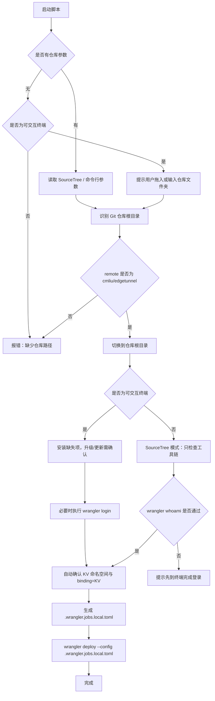

# `【MacOS@SourceTree】同步edgetunnel代码后手动升级.command`


[toc]

---

## 🔥 <font id=前言>前言</font> <a href="#🔚" style="font-size:17px; color:green;"><b>🔽</b></a>

这个脚本用于在 [**SourceTree**](https://www.sourcetreeapp.com/) 自定义操作中，对 `cmliu/edgetunnel` 仓库执行手动部署。

最初目标动作是：

```shell
npx wrangler login
npx wrangler kv namespace list
npx wrangler kv namespace create JobsGo   # 仅在 JobsGo 不存在时执行
npx wrangler deploy --config .wrangler.jobs.local.toml
```

但 SourceTree 自定义操作窗口不是稳定的 OAuth 登录环境，也不适合执行 `brew update`、`brew upgrade`、`npm install -g` 这类工具链变更。因此当前脚本拆成两种模式：

| 运行模式 | 负责内容 | 是否安装/升级工具链 | 是否执行 `wrangler login` |
| --- | --- | --- | --- |
| 独立双击 / 终端运行 | 首次准备环境、登录、部署 | 安装缺失项；升级/更新类操作需手动确认 | 未登录时执行 |
| SourceTree 自定义操作 | 校验仓库、检查工具链、部署 | 否 | 否 |

核心原则：**终端负责初始化，SourceTree 只负责部署。**

本版已经把 edgetunnel 的 KV 绑定自动化：部署前会检查 `KV` 绑定，默认查找或创建名为 `JobsGo` 的 KV 命名空间，并生成 `.wrangler.jobs.local.toml` 作为本地部署配置。原始 `wrangler.toml` 不会被改脏，避免后续同步上游代码时产生不必要冲突。

---

## 一、适用场景 <a href="#前言" style="font-size:17px; color:green;"><b>🔼</b></a> <a href="#🔚" style="font-size:17px; color:green;"><b>🔽</b></a>

适合以下场景：

- 在 [**SourceTree**](https://www.sourcetreeapp.com/) 中同步 `edgetunnel` 代码后，点自定义菜单完成 Cloudflare Worker 部署。
- 脚本不在仓库目录内，但需要部署指定的 `cmliu/edgetunnel` 仓库。
- 第一次独立运行时，手动拖入或输入 `edgetunnel` 仓库文件夹。
- 兼容 Git remote 的 HTTPS 与 SSH 写法：

  ```text
  https://github.com/cmliu/edgetunnel.git
  https://github.com/cmliu/edgetunnel
  git@github.com:cmliu/edgetunnel.git
  ssh://git@github.com/cmliu/edgetunnel.git
  ```

不适合以下场景：

- 不是 `cmliu/edgetunnel` 的仓库。
- 没有 Cloudflare 账号或没有部署权限。
- 想在 SourceTree 窗口里做首次 OAuth 登录。
- 想在 SourceTree 窗口里安装或升级 `Node.js`、`npm`、`npx`、`wrangler`。

---

## 二、运行方式 <a href="#前言" style="font-size:17px; color:green;"><b>🔼</b></a> <a href="#🔚" style="font-size:17px; color:green;"><b>🔽</b></a>

### 2.1、第一次初始化：独立双击或终端运行

第一次先在普通终端里跑，不要先从 SourceTree 跑。

可以双击脚本，然后拖入仓库目录：

```text
/Users/jobs/Documents/Github/edgetunnel
```

也可以直接命令行运行：

```shell
/Users/jobs/SourceTree.sh/【MacOS@SourceTree】同步edgetunnel代码后手动升级.command/【MacOS@SourceTree】同步edgetunnel代码后手动升级.command \
  /Users/jobs/Documents/Github/edgetunnel
```

这个模式会处理：

| 阶段 | 动作 |
| --- | --- |
| 仓库校验 | 校验 remote 必须指向 `cmliu/edgetunnel` |
| 工具链准备 | 安装缺失的 `Homebrew`、`Node.js`、`npm`、`npx`、`wrangler`；已有工具的升级/更新操作需手动确认 |
| Gatekeeper 修复 | 清理 `wrangler` / `esbuild` 相关 `com.apple.quarantine` 标记 |
| Cloudflare 登录 | 未登录时执行 `wrangler login` |
| KV 自动绑定 | 检查 `KV` 绑定；默认查找/创建 `JobsGo`；生成 `.wrangler.jobs.local.toml` |
| 部署 | 执行 `wrangler deploy --config .wrangler.jobs.local.toml` |

升级/更新类操作默认不执行。看到下面这类提示时：

```text
是否刷新 Homebrew 索引：brew update（直接回车跳过；输入任意字符后回车执行）：
```

规则固定为：

```text
直接回车 = 跳过
输入任意字符后回车 = 执行
```

`brew update`、`brew upgrade node`、`npm install -g npm@latest`、`npm install -g wrangler@latest` 都按这个规则处理，避免一启动脚本就进入耗时升级。

### 2.2、SourceTree 自定义操作运行

在 SourceTree 自定义操作中，保持下面配置：

| 配置项 | 推荐值 |
| --- | --- |
| 菜单标题 | `同步edgetunnel代码后手动升级` |
| 运行的脚本 | `/Users/jobs/SourceTree.sh/【MacOS@SourceTree】同步edgetunnel代码后手动升级.command/【MacOS@SourceTree】同步edgetunnel代码后手动升级.command` |
| 参数 | `$REPO` |
| 在单独窗口中打开 | 勾选 |
| 显示完整输出 | 勾选 |

关键点：

- `运行的脚本` 必须指向同名文件夹里面真正的 `.command` 文件。
- `运行的脚本` 不能只指向外层 `.command` 文件夹。
- `参数` 必须是 `$REPO`，这样 SourceTree 才会把当前仓库路径传给脚本。
- SourceTree 模式不会执行 `brew update`、`brew upgrade node`、`npm install -g npm@latest`、`npm install -g wrangler@latest`。
- SourceTree 模式不会执行 `wrangler login`，只会用 `wrangler whoami --json` 检查是否已经登录。
- SourceTree 模式会自动检查/生成 KV 绑定配置，不再需要手动修改 Cloudflare Dashboard 或 `wrangler.toml`。

---

## 三、执行前检查 <a href="#前言" style="font-size:17px; color:green;"><b>🔼</b></a> <a href="#🔚" style="font-size:17px; color:green;"><b>🔽</b></a>

执行前建议确认：

| 检查项 | 要求 |
| --- | --- |
| 系统 | macOS |
| Shell | `/bin/zsh` |
| 仓库 | 必须是 `cmliu/edgetunnel` |
| SourceTree 参数 | 必须传 `$REPO` |
| Cloudflare 权限 | 当前账号有 Worker 部署权限 |
| 网络 | 可以访问 GitHub、npm、Cloudflare |
| 首次登录 | 必须在普通终端里完成，不要在 SourceTree 窗口里完成 |

如果刚替换过脚本，建议修复权限：

```shell
chmod +x "/Users/jobs/SourceTree.sh/【MacOS@SourceTree】同步edgetunnel代码后手动升级.command/【MacOS@SourceTree】同步edgetunnel代码后手动升级.command"
xattr -dr com.apple.quarantine "/Users/jobs/SourceTree.sh/【MacOS@SourceTree】同步edgetunnel代码后手动升级.command" 2>/dev/null || true
```

如果刚替换过 SourceTree 自定义菜单脚本包，建议重新运行一次：

```text
【MacOS】安装SourceTree自定义菜单.command
```

---

## 四、脚本执行命令 <a href="#前言" style="font-size:17px; color:green;"><b>🔼</b></a> <a href="#🔚" style="font-size:17px; color:green;"><b>🔽</b></a>

### 4.1、独立双击 / 终端模式

终端模式会按需执行：

```shell
wrangler login
wrangler kv namespace list
wrangler kv namespace create JobsGo       # 仅在 JobsGo 不存在时执行
wrangler deploy --config .wrangler.jobs.local.toml
```

如果本机或项目里已经能解析到 `wrangler`，脚本也会优先使用已有 `wrangler` 命令，避免重复触发 `npx` 的临时安装逻辑。

工具链处理规则：

| 操作 | 终端模式处理方式 |
| --- | --- |
| `brew update` | 已安装 Homebrew 时，询问后才执行 |
| `brew upgrade node` | 已安装 Node.js formula 时，询问后才执行 |
| `npm install -g npm@latest` | 询问后才执行；若缺少 `npx`，会自动补齐 |
| `npm install -g wrangler@latest` | 已有 `wrangler` 时，询问后才执行；缺失时自动安装 |

提示中的交互规则统一是：直接回车跳过；输入任意字符后回车执行。

### 4.2、SourceTree 模式

SourceTree 模式只执行检查和部署：

```shell
wrangler whoami --json
wrangler kv namespace list
wrangler kv namespace create JobsGo       # 仅在 JobsGo 不存在时执行
wrangler deploy --config .wrangler.jobs.local.toml
```

这里的 `wrangler` 会优先取：

| 优先级 | 路径 |
| --- | --- |
| 1 | 当前仓库 `node_modules/.bin/wrangler` |
| 2 | 全局 `wrangler` |

找不到已安装的 `wrangler` 时，SourceTree 模式直接停止，并提示先去终端初始化。

补充说明：

- 终端模式默认保留彩色输出。
- SourceTree 自定义操作窗口不完整支持 ANSI 颜色，所以脚本会自动识别非 TTY 输出，并降级为纯文本。
- 如果仍想在终端里强制使用纯文本，可以这样运行：

  ```shell
  JOBS_PLAIN_OUTPUT=1 /Users/jobs/SourceTree.sh/【MacOS@SourceTree】同步edgetunnel代码后手动升级.command/【MacOS@SourceTree】同步edgetunnel代码后手动升级.command \
    /Users/jobs/Documents/Github/edgetunnel
  ```

---

## 五、流程图 <a href="#前言" style="font-size:17px; color:green;"><b>🔼</b></a> <a href="#🔚" style="font-size:17px; color:green;"><b>🔽</b></a>



---

## 六、日志文件 <a href="#前言" style="font-size:17px; color:green;"><b>🔼</b></a> <a href="#🔚" style="font-size:17px; color:green;"><b>🔽</b></a>

主日志写入：

```text
/tmp/【MacOS@SourceTree】同步edgetunnel代码后手动升级.log
```

排查时可以开另一个终端实时看：

```shell
tail -f "/tmp/【MacOS@SourceTree】同步edgetunnel代码后手动升级.log"
```

`wrangler` 自己的日志一般在：

```text
/Users/jobs/Library/Preferences/.wrangler/logs/
```

---

## 七、常见问题 <a href="#前言" style="font-size:17px; color:green;"><b>🔼</b></a> <a href="#🔚" style="font-size:17px; color:green;"><b>🔽</b></a>

### 7.1、SourceTree 里为什么不再安装/升级 `wrangler`？

因为 `npm install -g wrangler@latest` 会触发 `esbuild`、`workerd`、`sharp` 等依赖的安装脚本。SourceTree 自定义操作窗口不是完整终端环境，遇到 macOS Gatekeeper 弹窗时容易卡住或直接失败。

现在的规则是：

```text
终端模式：安装缺失项；升级/更新类操作手动确认；可以登录、部署
SourceTree 模式：只检查、只部署
```

### 7.2、为什么 `brew update` 需要手动确认？

`brew update` 是耗时操作，而且可能受网络、Homebrew 源、tap 数量影响。脚本现在不会在检测到 Homebrew 后自动刷新索引。

看到提示时按固定规则处理：

```text
直接回车 = 跳过 brew update
输入任意字符后回车 = 执行 brew update
```

跳过后，脚本会继续使用当前本机已有的 Homebrew 索引和工具链。

### 7.3、SourceTree 里出现 `[0m`、`[1;32m` 这类乱码怎么办？

这是 ANSI 颜色控制符没有被 SourceTree 自定义操作窗口识别。终端能正确显示颜色，但 SourceTree 只按普通文本输出，就会把控制符原样打印出来。

新版脚本已经处理：

```text
终端模式：保留彩色日志
SourceTree 模式：自动降级为纯文本日志
```

如果某次仍然看到控制符，优先确认 SourceTree 调用的是新版脚本，不是旧路径里的旧脚本。

### 7.4、出现“Apple 无法验证 esbuild”怎么办？

这是 macOS Gatekeeper 对 `esbuild` 二进制的拦截。新版脚本会在终端初始化阶段，对 `wrangler` / `esbuild` 相关目录清理 `com.apple.quarantine` 标记。

如果仍然出现，可以在终端手动执行：

```shell
xattr -dr com.apple.quarantine "$(npm root -g)/wrangler" 2>/dev/null || true
xattr -dr com.apple.quarantine "$(npm root -g)/esbuild" 2>/dev/null || true
xattr -dr com.apple.quarantine "$(npm root -g)/@esbuild" 2>/dev/null || true
xattr -dr com.apple.quarantine "/Users/jobs/Documents/Github/edgetunnel/node_modules" 2>/dev/null || true
```

### 7.5、SourceTree 报 `launch path not accessible`

这不是 `wrangler` 报错，通常是 SourceTree 在启动脚本之前就找不到或不能执行脚本。

重点检查：

```text
运行的脚本 = /Users/jobs/SourceTree.sh/脚本.command/脚本.command
参数       = $REPO
```

然后修复执行权限：

```shell
chmod +x "/Users/jobs/SourceTree.sh/【MacOS@SourceTree】同步edgetunnel代码后手动升级.command/【MacOS@SourceTree】同步edgetunnel代码后手动升级.command"
```

### 7.6、SourceTree 里提示未登录怎么办？

不要在 SourceTree 里登录。

先回到终端执行：

```shell
/Users/jobs/SourceTree.sh/【MacOS@SourceTree】同步edgetunnel代码后手动升级.command/【MacOS@SourceTree】同步edgetunnel代码后手动升级.command \
  /Users/jobs/Documents/Github/edgetunnel
```

完成 `wrangler login` 后，再回到 SourceTree 点自定义菜单。


### 7.7、为什么不直接改 `wrangler.toml`？

`wrangler.toml` 是上游仓库里的跟踪文件。直接把 KV id 写进去虽然能解决部署问题，但后续同步 `cmliu/edgetunnel` 时，如果上游也改了这个文件，容易出现本地改动阻塞拉取或产生冲突。

新版脚本改成：

```text
读取原始 wrangler.toml
自动追加 binding = "KV" 和 KV namespace id
写入本地生成文件 .wrangler.jobs.local.toml
使用 wrangler deploy --config .wrangler.jobs.local.toml 部署
```

`.wrangler.jobs.local.toml` 会自动加入 `.git/info/exclude`，不参与提交，也不污染上游同步。

自定义 KV 名称可以使用下面任一方式，优先级从高到低：

```shell
EDGETUNNEL_KV_NAMESPACE_TITLE=JobsGo
EDGETUNNEL_KV_NAMESPACE=JobsGo
JOBS_EDGETUNNEL_KV_NAMESPACE=JobsGo
```

也可以在仓库根目录放一个本地文件：

```text
.edgetunnel-kv-namespace
```

文件第一行写 KV 命名空间名称即可。默认值仍然是 `JobsGo`。

---

## 八、风险说明 <a href="#前言" style="font-size:17px; color:green;"><b>🔼</b></a> <a href="#🔚" style="font-size:17px; color:green;"><b>🔽</b></a>

这个脚本不是只读脚本。

终端模式会执行以下有影响的操作：

- 可能安装缺失的 `Homebrew`、`git`、`Node.js`、`npm`、`npx`、`wrangler`。
- `brew update`、`brew upgrade node`、`npm install -g npm@latest`、`npm install -g wrangler@latest` 等升级/更新类操作需要手动确认，不会默认执行。
- 可能清理 `wrangler` / `esbuild` 相关目录的 `com.apple.quarantine` 标记。
- 会执行 Cloudflare 登录流程。
- 会读取 Cloudflare KV 命名空间列表。
- 找不到默认 KV 命名空间 `JobsGo` 时，会自动创建 KV 命名空间。
- 会在仓库根目录生成 `.wrangler.jobs.local.toml`，并加入 `.git/info/exclude`。
- 会执行 `wrangler deploy --config .wrangler.jobs.local.toml`，部署线上 Worker。
- 如果仓库内 `package.json` 已声明 `wrangler`，可能修改本仓库依赖版本。

SourceTree 模式会执行以下动作：

- 校验仓库。
- 检查已有工具链。
- 检查 Cloudflare 登录状态。
- 检查/生成 KV 绑定配置。
- 执行 `wrangler deploy --config .wrangler.jobs.local.toml`。

不确认 Cloudflare 账号、目标项目和当前仓库时，不要执行。

---

## 九、未执行声明 <a href="#前言" style="font-size:17px; color:green;"><b>🔼</b></a> <a href="#🔚" style="font-size:17px; color:green;"><b>🔽</b></a>

当前 README 只说明脚本用途和风险。

生成 README 时未实际执行：

```shell
brew update
brew upgrade node
npm install -g npm@latest
npm install -g wrangler@latest
wrangler login
wrangler kv namespace list
wrangler kv namespace create JobsGo
wrangler deploy --config .wrangler.jobs.local.toml
```

建议在本机执行前先做静态检查：

```shell
zsh -n "【MacOS@SourceTree】同步edgetunnel代码后手动升级.command"
```

<a id="🔚" href="#前言" style="font-size:17px; color:green; font-weight:bold;">我是有底线的➤点我回到首页</a>
