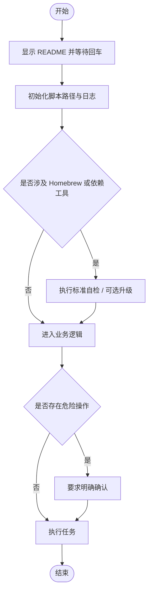

# `【MacOS@SourceTree】用VSCode打开.command`


[toc]

## 🔥 <font id=前言>前言</font>

- 采用 Shell 脚本的原因：Shell 来自 [**macOS**](https://www.apple.com/macos/) 原生系统底层，虽然写法相对繁琐冗杂，但执行效率高，并且不需要额外介入 [**Ruby**](https://www.ruby-lang.org)、[**Python**](https://www.python.org) 等第三方运行环境，因此具备更好的移植性。

- 本自述文件对应脚本：`【MacOS@SourceTree】用VSCode打开.command`。
- 脚本原始位置：`JobsGenesis@JobsCommand.SourceTree`。
- 脚本定位：用于 SourceTree 自定义操作入口。 用于打开或配置开发工具。
- 本次已按 Jobs 标准升级：`#!/bin/zsh`、README 防误触、彩色日志、结构化入口、`main "$@"` 收口。
- 普通安装 / 更新 / 升级交互统一为：**回车跳过，输入任意字符后回车执行**。
- 危险操作不应该靠回车默认执行；涉及破坏性修改时，应单独输入 `YES` 确认。

## 一、脚本用途 <a href="#前言" style="font-size:17px; color:green;"><b>🔼</b></a> <a href="#🔚" style="font-size:17px; color:green;"><b>🔽</b></a>

| 项目 | 说明 |
|---|---|
| 脚本名称 | `【MacOS@SourceTree】用VSCode打开.command` |
| 所属目录 | `JobsGenesis@JobsCommand.SourceTree` |
| 主要标签 | `SourceTree, 工具入口` |
| 是否涉及 Homebrew | `否` |
| 是否可能联网 | `否` |
| 是否含高风险命令 | `否` |
| zsh 静态检查 | `当前生成环境未执行，请在 macOS 上复核` |

## 二、运行方式 <a href="#前言" style="font-size:17px; color:green;"><b>🔼</b></a> <a href="#🔚" style="font-size:17px; color:green;"><b>🔽</b></a>

推荐双击 `.command` 运行。终端方式如下：

```shell
chmod +x './【MacOS@SourceTree】用VSCode打开.command'
'./【MacOS@SourceTree】用VSCode打开.command'
```

脚本启动后会先显示本 README，并等待回车继续，避免误触执行。

## 三、本次升级内容 <a href="#前言" style="font-size:17px; color:green;"><b>🔼</b></a> <a href="#🔚" style="font-size:17px; color:green;"><b>🔽</b></a>

- 统一脚本解释器为 `#!/bin/zsh`。
- 增加 README 展示与回车阻塞，防止双击误操作。
- 增加 Jobs 标准彩色日志函数，日志路径为 `/tmp/脚本名.log`。
- 增加 `SCRIPT_DIR` / `SCRIPT_PATH` 标准路径变量。
- 使用 `main "$@"` 作为统一入口。
- 原业务逻辑保留在 `run_original_logic` 模块内，方便后续继续拆分重构。

## 四、Homebrew 标准 <a href="#前言" style="font-size:17px; color:green;"><b>🔼</b></a> <a href="#🔚" style="font-size:17px; color:green;"><b>🔽</b></a>

若脚本涉及 Homebrew，统一遵循下面的健康标准：

- 自动识别 `arm64` / `x86_64`。
- Apple Silicon 优先使用 `/opt/homebrew/bin/brew`。
- Intel 优先使用 `/usr/local/bin/brew`。
- 自动把 `brew shellenv` 写入当前 shell 对应配置文件。
- 当前会话立即 `eval "$({brew_bin} shellenv)"` 生效。
- 已安装时不强制升级，而是询问：**回车跳过，输入任意字符后回车升级**。
- 健康更新顺序为：`brew update` → `brew upgrade` → `brew cleanup` → `brew doctor` → `brew -v`。

## 五、注意事项 <a href="#前言" style="font-size:17px; color:green;"><b>🔼</b></a> <a href="#🔚" style="font-size:17px; color:green;"><b>🔽</b></a>

- 我没有在生成阶段执行脚本里的 macOS 专属命令，例如 `brew`、`pod`、`flutter`、`xcodebuild`、`osascript`、`sudo`、模拟器控制等。
- 首次运行前建议先阅读本 README，再执行脚本。
- 如果脚本涉及工程目录，请确认当前目录或拖入路径正确。
- 如果脚本涉及 Git / CocoaPods / Flutter 依赖更新，建议先提交或备份本地改动。
- 运行日志默认写入：`/tmp/【MacOS@SourceTree】用VSCode打开.log`。

## 六、流程图 <a href="#前言" style="font-size:17px; color:green;"><b>🔼</b></a> <a href="#🔚" style="font-size:17px; color:green;"><b>🔽</b></a>



<a id="🔚" href="#前言" style="font-size:17px; color:green; font-weight:bold;">我是有底线的➤点我回到首页</a>
