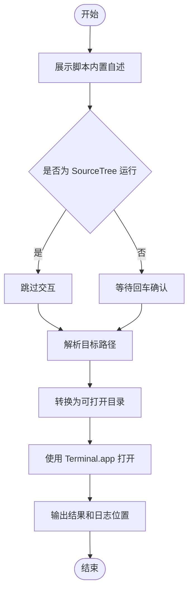

# `【MacOS@SourceTree】用终端打开.command`


[toc]

---

## 🔥 <font id=前言>前言</font>

- 本自述文件对应脚本：`【MacOS@SourceTree】用终端打开.command`。
- 脚本定位：用于 [**SourceTree**](https://www.sourcetreeapp.com/) 自定义动作入口，打开 macOS `Terminal.app` 后让命令行直接进入当前仓库、文件所在目录或指定目录。
- 推荐参数：在 [**SourceTree**](https://www.sourcetreeapp.com/) 自定义动作的参数栏填写 `$REPO`。
- 核心结果：脚本会打开终端窗口，并执行 `cd` 进入目标目录；如果传入文件，则进入文件所在目录。
- 安全边界：不提交、不推送、不删除、不修改 Git 索引或业务文件。
- 日志位置：系统临时目录中的 `【MacOS@SourceTree】用终端打开.log`。

## 一、脚本用途 <a href="#前言" style="font-size:17px; color:green;"><b>🔼</b></a> <a href="#🔚" style="font-size:17px; color:green;"><b>🔽</b></a>

| 项目 | 说明 |
|---|---|
| 脚本名称 | `【MacOS@SourceTree】用终端打开.command` |
| 主要入口 | [**SourceTree**](https://www.sourcetreeapp.com/) 自定义动作 |
| 推荐参数 | `$REPO` |
| 打开应用 | macOS `Terminal.app` |
| 终端位置 | 新窗口命令行直接进入目标目录 |
| 文件目标 | 自动打开所在目录 |
| 是否修改项目文件 | `否` |
| 是否修改 Git 状态 | `否` |
| 是否可能联网 | `否` |

## 二、运行方式 <a href="#前言" style="font-size:17px; color:green;"><b>🔼</b></a> <a href="#🔚" style="font-size:17px; color:green;"><b>🔽</b></a>

### 2.1、SourceTree 自定义动作

- 推荐配置如下：

  | 配置项 | 建议值 |
  |---|---|
  | 脚本 | `./【MacOS@SourceTree】用终端打开.command` |
  | 参数 | `$REPO` |
  | 输出 | 建议开启完整输出，方便排查路径来源 |

- 运行后脚本会把 `$REPO` 解析为物理目录路径，并打开 `Terminal.app` 新窗口执行 `cd` 到该目录。

### 2.2、终端独立运行

- 进入脚本目录后执行：

  ```shell
  chmod +x './【MacOS@SourceTree】用终端打开.command'
  './【MacOS@SourceTree】用终端打开.command' '/path/to/target'
  ```

- 不传参数时，脚本会先展示内置自述，再让你拖入或输入目标路径；直接回车会使用当前工作目录。

## 三、路径解析规则 <a href="#前言" style="font-size:17px; color:green;"><b>🔼</b></a> <a href="#🔚" style="font-size:17px; color:green;"><b>🔽</b></a>

| 优先级 | 来源 | 说明 |
|---|---|---|
| 1 | 命令行参数 | [**SourceTree**](https://www.sourcetreeapp.com/) 配置 `$REPO` 后会走这里 |
| 2 | 环境变量 `REPO` | 兼容其它脚本入口 |
| 3 | 终端输入 | 独立运行且没有参数时使用 |

- 输入目录时，终端会直接进入该目录。
- 输入文件时，终端会进入文件所在目录。
- 相对路径会按当前工作目录转换。
- `~/xxx` 会展开为当前用户家目录。
- 目标不存在时会停止，并在日志里输出无法解析的原始路径。

## 四、风险说明 <a href="#前言" style="font-size:17px; color:green;"><b>🔼</b></a> <a href="#🔚" style="font-size:17px; color:green;"><b>🔽</b></a>

- 脚本不会执行 `git add`、`git commit`、`git push`、`rm`、`sudo` 等动作。
- 脚本会写入系统临时目录日志，用于排查 [**SourceTree**](https://www.sourcetreeapp.com/) 输出窗口关闭后的历史结果。
- 脚本使用 AppleScript 打开 `Terminal.app`，并执行 `cd` 到目标目录；如果系统自动化权限异常，日志会输出失败原因。

## 五、流程图 <a href="#前言" style="font-size:17px; color:green;"><b>🔼</b></a> <a href="#🔚" style="font-size:17px; color:green;"><b>🔽</b></a>



<a id="🔚" href="#前言" style="font-size:17px; color:green; font-weight:bold;">我是有底线的➤点我回到首页</a>
