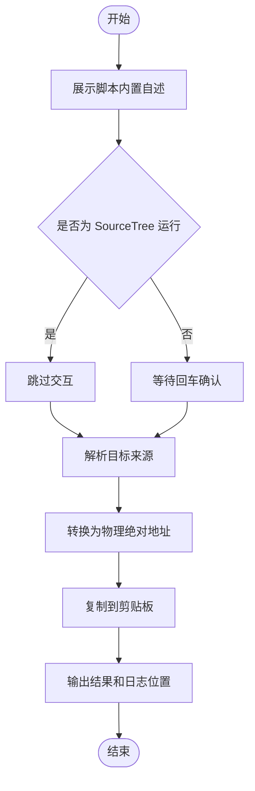

# `【MacOS@SourceTree】获取目标绝对地址.command`


[toc]

---

## 🔥 <font id=前言>前言</font>

- 本自述文件对应脚本：`【MacOS@SourceTree】获取目标绝对地址.command`。
- 脚本定位：用于 [**SourceTree**](https://www.sourcetreeapp.com/) 自定义动作入口，快速拿到当前仓库、文件或目录的物理绝对地址。
- 推荐参数：在 [**SourceTree**](https://www.sourcetreeapp.com/) 自定义动作的参数栏填写 `$REPO`。
- 核心结果：脚本会在输出窗口打印绝对地址，并同步复制到 macOS 剪贴板。
- 安全边界：不提交、不推送、不删除、不修改 Git 索引或业务文件。
- 日志位置：系统临时目录中的 `【MacOS@SourceTree】获取目标绝对地址.log`。

## 一、脚本用途 <a href="#前言" style="font-size:17px; color:green;"><b>🔼</b></a> <a href="#🔚" style="font-size:17px; color:green;"><b>🔽</b></a>

| 项目 | 说明 |
|---|---|
| 脚本名称 | `【MacOS@SourceTree】获取目标绝对地址.command` |
| 主要入口 | [**SourceTree**](https://www.sourcetreeapp.com/) 自定义动作 |
| 推荐参数 | `$REPO` |
| 输出内容 | 目标物理绝对地址 |
| 剪贴板 | 自动复制解析结果 |
| 是否修改项目文件 | `否` |
| 是否修改 Git 状态 | `否` |
| 是否可能联网 | `否` |

## 二、运行方式 <a href="#前言" style="font-size:17px; color:green;"><b>🔼</b></a> <a href="#🔚" style="font-size:17px; color:green;"><b>🔽</b></a>

### 2.1、SourceTree 自定义动作

- 推荐配置如下：

  | 配置项 | 建议值 |
  |---|---|
  | 脚本 | `./【MacOS@SourceTree】获取目标绝对地址.command` |
  | 参数 | `$REPO` |
  | 输出 | 建议开启完整输出，方便直接看到绝对地址 |

- 运行后会得到两份结果：

  | 位置 | 内容 |
  |---|---|
  | 输出窗口 | 目标绝对地址、来源、日志位置 |
  | macOS 剪贴板 | 目标绝对地址 |

### 2.2、终端独立运行

- 进入脚本目录后执行：

  ```shell
  chmod +x './【MacOS@SourceTree】获取目标绝对地址.command'
  './【MacOS@SourceTree】获取目标绝对地址.command' '/path/to/target'
  ```

- 不传参数时，脚本会先展示内置自述，再让你拖入或输入目标路径；直接回车会使用当前工作目录。

## 三、路径解析规则 <a href="#前言" style="font-size:17px; color:green;"><b>🔼</b></a> <a href="#🔚" style="font-size:17px; color:green;"><b>🔽</b></a>

| 优先级 | 来源 | 说明 |
|---|---|---|
| 1 | 命令行参数 | [**SourceTree**](https://www.sourcetreeapp.com/) 配置 `$REPO` 后会走这里 |
| 2 | 环境变量 `REPO` | 兼容其它脚本入口 |
| 3 | 终端输入 | 独立运行且没有参数时使用 |

- 输入可以是文件，也可以是目录。
- 相对路径会按当前工作目录转换。
- `~/xxx` 会展开为当前用户家目录。
- 如果目标不存在但父目录存在，脚本仍会给出可定位的绝对地址。

## 四、风险说明 <a href="#前言" style="font-size:17px; color:green;"><b>🔼</b></a> <a href="#🔚" style="font-size:17px; color:green;"><b>🔽</b></a>

- 脚本不会执行 `git add`、`git commit`、`git push`、`rm`、`sudo` 等动作。
- 脚本会写入系统临时目录日志，用于排查 SourceTree 输出窗口关闭后的历史结果。
- 脚本会调用 `pbcopy` 写入 macOS 剪贴板；如果系统缺少 `pbcopy`，只打印结果并跳过复制。

## 五、流程图 <a href="#前言" style="font-size:17px; color:green;"><b>🔼</b></a> <a href="#🔚" style="font-size:17px; color:green;"><b>🔽</b></a>



<a id="🔚" href="#前言" style="font-size:17px; color:green; font-weight:bold;">我是有底线的➤点我回到首页</a>
