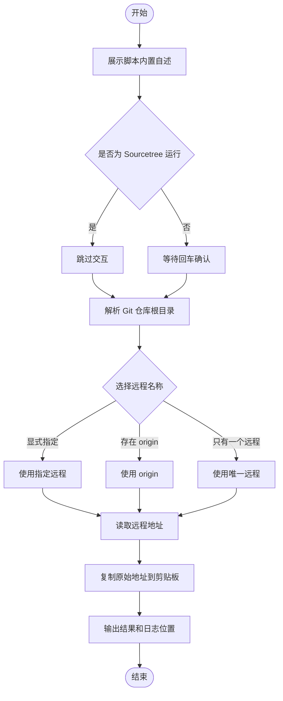

# `【MacOS@SourceTree】🌐获取远程仓库地址.command`


[toc]

---

## 🔥 <font id=前言>前言</font>

- 本自述文件对应脚本：`./【MacOS@SourceTree】🌐获取远程仓库地址.command`。
- 脚本定位：用于 [**Sourcetree**](https://www.sourcetreeapp.com/) 自定义动作入口，快速获取当前 Git 仓库的首选远程仓库地址。
- 推荐参数：在 Sourcetree 自定义动作的参数栏填写 `$REPO`。
- 核心结果：脚本会在输出窗口打印远程名称和地址，并把原始远程地址复制到 macOS 剪贴板。
- 安全边界：不联网、不提交、不推送、不修改 Git 配置、索引或业务文件。
- 日志位置：系统临时目录中的 `【MacOS@SourceTree】🌐获取远程仓库地址.log`。

## 一、脚本用途 <a href="#前言" style="font-size:17px; color:green;"><b>🔼</b></a> <a href="#🔚" style="font-size:17px; color:green;"><b>🔽</b></a>

| 项目 | 说明 |
|---|---|
| 脚本名称 | `【MacOS@SourceTree】🌐获取远程仓库地址.command` |
| 主要入口 | Sourcetree 自定义动作 |
| 推荐参数 | `$REPO` |
| 默认远程 | `origin` |
| 输出内容 | 仓库根目录、远程名称、远程仓库地址 |
| 剪贴板 | 自动复制 Git 配置中的原始远程地址 |
| 是否修改项目文件 | `否` |
| 是否修改 Git 状态 | `否` |
| 是否联网 | `否` |

## 二、运行方式 <a href="#前言" style="font-size:17px; color:green;"><b>🔼</b></a> <a href="#🔚" style="font-size:17px; color:green;"><b>🔽</b></a>

### 2.1、Sourcetree 自定义动作

- 推荐配置如下：

  | 配置项 | 建议值 |
  |---|---|
  | 脚本 | `./【MacOS@SourceTree】🌐获取远程仓库地址.command` |
  | 参数 | `$REPO` |
  | 输出 | 建议开启完整输出，方便核对仓库和远程名称 |

- 运行后会得到两份结果：

  | 位置 | 内容 |
  |---|---|
  | 输出窗口 | 仓库根目录、远程名称、远程地址和日志位置 |
  | macOS 剪贴板 | Git 配置中的原始远程地址 |

### 2.2、终端独立运行

- 进入脚本目录后执行：

  ```shell
  './【MacOS@SourceTree】🌐获取远程仓库地址.command' '/path/to/repository'
  ```

- 仓库没有 `origin` 且包含多个远程时，可以把远程名作为第二个参数：

  ```shell
  './【MacOS@SourceTree】🌐获取远程仓库地址.command' '/path/to/repository' 'upstream'
  ```

- 不传参数时，脚本会先展示内置自述，再让你拖入或输入目标仓库路径；直接回车会使用当前工作目录。

## 三、远程选择规则 <a href="#前言" style="font-size:17px; color:green;"><b>🔼</b></a> <a href="#🔚" style="font-size:17px; color:green;"><b>🔽</b></a>

| 优先级 | 来源 | 说明 |
|---|---|---|
| 1 | 第二个命令行参数或 `REMOTE_NAME_OVERRIDE` | 显式指定远程名称 |
| 2 | `origin` | Git 仓库的常用默认远程 |
| 3 | 唯一远程 | 没有 `origin` 且仅配置一个远程时自动采用 |

- 没有任何远程时，脚本会明确报错退出。
- 没有 `origin` 且存在多个远程时，脚本不会猜测；输出可用远程列表后退出。
- 获取的是 `git remote get-url` 返回的首个抓取地址，SSH 和 HTTPS 形式都会保留原样。

## 四、安全与隐私 <a href="#前言" style="font-size:17px; color:green;"><b>🔼</b></a> <a href="#🔚" style="font-size:17px; color:green;"><b>🔽</b></a>

- 脚本只读取本地 Git 配置，不会执行 `fetch`、`pull`、`push` 或其它联网命令。
- 脚本不会执行 `git add`、`git commit`、`git config`、`rm` 或 `sudo`。
- 如果 HTTP 远程地址包含用户信息，终端输出和日志会把用户信息替换为 `***`。
- 剪贴板始终保留 Git 配置中的原始远程地址；粘贴到聊天、工单或公开文档前应确认其中不含凭据。
- 如果系统缺少 `pbcopy`，脚本仍会打印结果，只跳过剪贴板复制。

## 五、流程图 <a href="#前言" style="font-size:17px; color:green;"><b>🔼</b></a> <a href="#🔚" style="font-size:17px; color:green;"><b>🔽</b></a>



<a id="🔚" href="#前言" style="font-size:17px; color:green; font-weight:bold;">我是有底线的➤点我回到首页</a>
