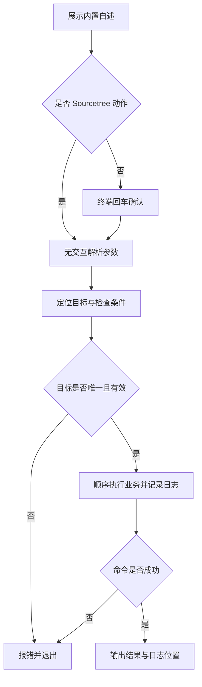

# `【MacOS@SourceTree】🐦Flutter自动化生产代码.command`


[toc]

---

## 🔥 <font id=前言>前言</font>

这是 [**Sourcetree**](https://www.sourcetreeapp.com/) 的 [**Flutter**](https://flutter.dev/) 工程动作。根据工程 `pubspec.yaml` 及目录约定，顺序生成所需代码和资源。

## 一、运行方式 <a href="#前言" style="font-size:17px; color:green;"><b>🔼</b></a> <a href="#🔚" style="font-size:17px; color:green;"><b>🔽</b></a>

在 Sourcetree 已安装的动作中传入 `$REPO`。系统终端独立运行先打印脚本内置自述，按回车继续，按 `Ctrl+C` 取消；运行时不读取 README。Sourcetree 身份通过环境变量或父进程确认，非 TTY 本身不会绕过确认。

```shell
zsh "./【MacOS@SourceTree】🐦Flutter自动化生产代码.command" "<工程目录>"
```

只接受一个可选工程路径；`CLEAN_FIRST=0` 跳过默认 clean；`WATCH=1` 在终端完成其他生成步骤后开启 build_runner watch。Sourcetree 永远不启动持续 watch。

自述与确认阶段只输出到屏幕；确认后才初始化日志。非 Sourcetree 且没有交互输入时直接退出，不执行工程业务。

## 二、执行前检查 <a href="#前言" style="font-size:17px; color:green;"><b>🔼</b></a> <a href="#🔚" style="font-size:17px; color:green;"><b>🔽</b></a>

需要工程 Flutter / [**Dart**](https://dart.dev) SDK。使用 Protobuf 时还需要 `protoc` 与 `protoc-gen-dart`；不自动安装工具或增加项目依赖。

路径支持中文、空格和拖拽外层引号。需要递归定位的工程动作会排除依赖、缓存和构建目录；多个工程候选时应直接指定目标。

## 三、实际执行流程 <a href="#前言" style="font-size:17px; color:green;"><b>🔼</b></a> <a href="#🔚" style="font-size:17px; color:green;"><b>🔽</b></a>

检测真实 YAML 键，不因注释包名触发生成。Pigeon 按 `pigeons/messages.dart` 约定运行；Protobuf 的输入为空或工具缺失会明确失败。任何生成器失败立即停止，不打印“全部完成”。现代调用方式参考 [Dart build_runner 官方说明](https://dart.dev/tools/build_runner)。

```shell
flutter clean
flutter pub get
dart run build_runner build --delete-conflicting-outputs
dart run flutter_launcher_icons
dart run flutter_native_splash:create
flutter gen-l10n
dart run ffigen
dart run pigeon --input pigeons/messages.dart --dart_out lib/pigeon/messages.g.dart
protoc --dart_out=grpc:lib/generated -Iprotos protos/*.proto
```

## 四、风险与失败处理 <a href="#前言" style="font-size:17px; color:green;"><b>🔼</b></a> <a href="#🔚" style="font-size:17px; color:green;"><b>🔽</b></a>

只有检测到对应配置 / 目录的生成器才执行。build_runner 的 `--delete-conflicting-outputs` 允许处理生成文件冲突；执行前保留源码改动。图标直接交给生成器维护，本脚本不提前删除图标，生成器失败后不会造成原图标被本脚本清空。

Sourcetree 不发起输入等待；无法安全确定目标或缺少必要条件时直接报错。外部命令失败返回非零状态，后续业务停止。脚本及外部输出在受限输出窗口使用纯文本。

## 五、日志与产物 <a href="#前言" style="font-size:17px; color:green;"><b>🔼</b></a> <a href="#🔚" style="font-size:17px; color:green;"><b>🔽</b></a>

执行日志位于系统临时目录，文件名为 `【MacOS@SourceTree】🐦Flutter自动化生产代码.log`。终端和 Sourcetree 都会打印实际日志位置。

## 六、验证边界 <a href="#前言" style="font-size:17px; color:green;"><b>🔼</b></a> <a href="#🔚" style="font-size:17px; color:green;"><b>🔽</b></a>

已用隔离假 SDK 验证 Sourcetree 传入目录、FVM 在工程目录解析、生成器顺序、注释不会触发、失败后停止以及已有图标保留。

已通过 `zsh -n` 静态语法检查。 入口已隔离验证非交互拒绝、确认前不创建日志、`NO_COLOR` 空值降级与业务失败退出码传播。隔离夹具验证没有运行真实 Flutter / Xcode 构建、安装、依赖清理或模拟器操作；真实工程的签名、网络和工具版本仍需按运行日志确认。

## 七、流程图 <a href="#前言" style="font-size:17px; color:green;"><b>🔼</b></a> <a href="#🔚" style="font-size:17px; color:green;"><b>🔽</b></a>



<a id="🔚" href="#前言" style="font-size:17px; color:green; font-weight:bold;">我是有底线的➤点我回到首页</a>
