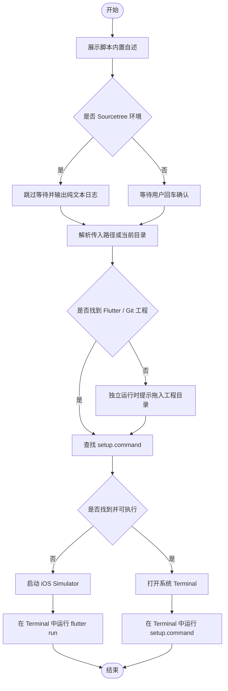

# `【MacOS@SourceTree】🐦打开/运行Flutter项目.command`


[toc]

## 🔥 <font id=前言>前言</font>

- 采用 Shell 脚本的原因：Shell 来自 [**macOS**](https://www.apple.com/macos/) 原生系统底层，虽然写法相对繁琐冗杂，但执行效率高，并且不需要额外介入 [**Ruby**](https://www.ruby-lang.org)、[**Python**](https://www.python.org) 等第三方运行环境，因此具备更好的移植性。

- 本自述文件对应脚本：`【MacOS@SourceTree】🐦打开:运行Flutter项目.command`。
- 脚本原始位置：`JobsGenesis@JobsCommand.SourceTree`。
- 脚本定位：用于 SourceTree 自定义操作入口。优先定位 Flutter 工程里的 `setup.command`，没有 `setup.command` 时回退为在系统 Terminal 中先启动 iOS Simulator，再执行 `flutter run`。
- 脚本运行策略：Sourcetree 只负责触发和定位，真正需要人工选择的流程回到系统 Terminal，避免 Sourcetree 受限输出窗口吞掉交互。
- 普通安装 / 更新 / 升级交互统一为：**回车跳过，输入任意字符后回车执行**。
- 危险操作不应该靠回车默认执行；涉及破坏性修改时，应单独输入 `YES` 确认。

## 一、脚本用途 <a href="#前言" style="font-size:17px; color:green;"><b>🔼</b></a> <a href="#🔚" style="font-size:17px; color:green;"><b>🔽</b></a>

| 项目 | 说明 |
|---|---|
| 脚本名称 | `【MacOS@SourceTree】🐦打开:运行Flutter项目.command` |
| 所属目录 | `JobsGenesis@JobsCommand.SourceTree` |
| 主要标签 | `SourceTree, Flutter, setup.command, flutter run, Terminal` |
| 是否涉及 Homebrew | `否` |
| 是否可能联网 | `取决于 setup.command、模拟器启动或 flutter run 内部逻辑` |
| 是否含高风险命令 | `本脚本不含；setup.command 或 Flutter 工程内部以实际行为为准` |
| zsh 静态检查 | `已通过 zsh -n` |

## 二、运行方式 <a href="#前言" style="font-size:17px; color:green;"><b>🔼</b></a> <a href="#🔚" style="font-size:17px; color:green;"><b>🔽</b></a>

推荐在 Sourcetree 自定义操作中使用，也可以双击 `.command` 独立运行。终端方式如下：

```shell
chmod +x './【MacOS@SourceTree】🐦打开:运行Flutter项目.command'
'./【MacOS@SourceTree】🐦打开:运行Flutter项目.command' '<flutter-root>/project'
```

独立运行且未能从当前目录定位 Flutter 工程时，脚本会提示输入或拖入 Flutter 工程目录、`pubspec.yaml` 或仓库内任意文件。

## 三、脚本运行策略 <a href="#前言" style="font-size:17px; color:green;"><b>🔼</b></a> <a href="#🔚" style="font-size:17px; color:green;"><b>🔽</b></a>

- 脚本使用 `# shell: zsh` 和 `main "$@"` 统一收口，先展示脚本内置自述，再进入真实业务逻辑。
- 系统终端双击运行时，脚本保持完整终端体验：可清屏、可彩色输出、可等待用户回车确认。
- Sourcetree 自定义动作运行时，脚本会识别瘦身环境，自动跳过 `clear` 和回车等待，并关闭 ANSI 彩色码，避免日志里出现 ANSI 转义码。
- 脚本会兜底解析真实脚本目录，确保 Sourcetree 只传脚本名时仍能定位自身。
- 脚本优先从 Sourcetree 传入参数、当前目录向上寻找 Flutter / Git 工程根目录。
- `setup.command` 查找顺序为：工程根目录 `setup.command` → `tool/setup/setup.command` → 递归查找。
- 递归查找会跳过 `.git`、`Pods`、`.dart_tool`、`build`、`DerivedData`、`node_modules`。
- 找到 `setup.command` 后，脚本只把命令交给系统 Terminal；入口、宿主、设备等人工选择仍由成熟的 `setup.command` 自己处理。
- 未找到 `setup.command` 时，脚本会在系统 Terminal 中进入 Flutter 工程根目录，先通过 `flutter emulators --launch apple_ios_simulator` 或 `open -a Simulator` 拉起 iOS Simulator，等待模拟器 Booted 后再执行 `flutter run`，兼容 `gsy_flutter_demo` 这类标准 Flutter 工程。
- 终端输出和日志同步落盘；排查时优先查看 README 中声明的 `$TMPDIR/脚本名.log`。

## 四、Sourcetree 配置建议 <a href="#前言" style="font-size:17px; color:green;"><b>🔼</b></a> <a href="#🔚" style="font-size:17px; color:green;"><b>🔽</b></a>

| 配置项 | 建议值 |
|---|---|
| 菜单名称 | `打开/运行Flutter项目` |
| 脚本路径 | `~/SourceTree.command/【MacOS@SourceTree】🐦打开:运行Flutter项目.command/【MacOS@SourceTree】🐦打开:运行Flutter项目.command` |
| 参数 | 当前仓库路径或 Sourcetree 支持的当前文件 / 当前仓库变量 |
| 执行结果 | Sourcetree 输出窗口只显示定位结果，后续交互在系统 Terminal 中继续 |

## 五、注意事项 <a href="#前言" style="font-size:17px; color:green;"><b>🔼</b></a> <a href="#🔚" style="font-size:17px; color:green;"><b>🔽</b></a>

- 本脚本不会替代 `setup.command`，只负责把 Sourcetree 触发动作桥接到系统 Terminal；工程没有 `setup.command` 时才回退为启动 iOS Simulator 后执行 `flutter run`。
- 如果工程里存在多个 `setup.command`，脚本会优先使用根目录或 `tool/setup/setup.command`。
- 如果 `setup.command` 没有执行权限，脚本会尝试 `chmod +x` 当前目标文件。
- 如果脚本涉及 Git / CocoaPods / Flutter 依赖更新，建议先提交或备份本地改动。
- Dry-run 验证可以设置环境变量：`JOBS_SOURCETREE_SETUP_DRY_RUN=1`。
- 运行日志默认写入：`$TMPDIR/【MacOS@SourceTree】🐦Flutter运行setup.command.log`。

## 六、流程图 <a href="#前言" style="font-size:17px; color:green;"><b>🔼</b></a> <a href="#🔚" style="font-size:17px; color:green;"><b>🔽</b></a>



<a id="🔚" href="#前言" style="font-size:17px; color:green; font-weight:bold;">我是有底线的➤点我回到首页</a>
