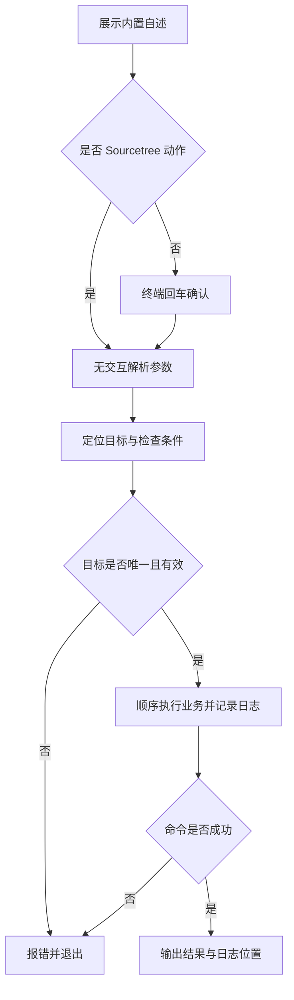

# `【MacOS@SourceTree】🐦打开:运行Flutter项目.command`


[toc]

---

## 🔥 <font id=前言>前言</font>

这是 [**Sourcetree**](https://www.sourcetreeapp.com/) 的 [**Flutter**](https://flutter.dev/) 工程动作。定位工程并把 `setup.command` 或标准 Flutter 运行流程交给系统 Terminal。

## 一、运行方式 <a href="#前言" style="font-size:17px; color:green;"><b>🔼</b></a> <a href="#🔚" style="font-size:17px; color:green;"><b>🔽</b></a>

在 Sourcetree 已安装的动作中传入 `$REPO`。系统终端独立运行先打印脚本内置自述，按回车继续，按 `Ctrl+C` 取消；运行时不读取 README。Sourcetree 身份通过环境变量或父进程确认，非 TTY 本身不会绕过确认。

```shell
zsh "./【MacOS@SourceTree】🐦打开:运行Flutter项目.command" "<工程目录>"
```

接受工程目录、`pubspec.yaml` 或工程内文件。`JOBS_SOURCETREE_SETUP_DRY_RUN=1` 只输出 Terminal 命令且不补执行权限；`SIMULATOR_WAIT_SECS` 默认 60，必须为正整数。

自述与确认阶段只输出到屏幕；确认后才初始化日志。非 Sourcetree 且没有交互输入时直接退出，不执行工程业务。

## 二、执行前检查 <a href="#前言" style="font-size:17px; color:green;"><b>🔼</b></a> <a href="#🔚" style="font-size:17px; color:green;"><b>🔽</b></a>

使用 macOS `osascript` 与 Terminal；标准回退还需要 Flutter、Xcode / `xcrun` 和 iOS Simulator。

路径支持中文、空格和拖拽外层引号。需要递归定位的工程动作会排除依赖、缓存和构建目录；多个工程候选时应直接指定目标。

## 三、实际执行流程 <a href="#前言" style="font-size:17px; color:green;"><b>🔼</b></a> <a href="#🔚" style="font-size:17px; color:green;"><b>🔽</b></a>

显式无效路径不会回退到其它当前工程。没有 setup.command 时，必须确认为 Flutter 根；选择工程 FVM 后启动模拟器，等待 Booted，超时明确停止。整个回退由成功的 cd 门禁包住，不会在目录切换失败后继续运行 Flutter。

```shell
# 优先：工程 setup.command
# 其次：tool/setup/setup.command
# 递归唯一候选，否则拒绝
flutter emulators --launch apple_ios_simulator
# 启动失败时用 open -a Simulator
flutter run -d "<已启动的模拟器UUID>"
```

## 四、风险与失败处理 <a href="#前言" style="font-size:17px; color:green;"><b>🔼</b></a> <a href="#🔚" style="font-size:17px; color:green;"><b>🔽</b></a>

找到 setup.command 后尝试补齐该文件执行权限，并将运行交给 Terminal；后续行为由工程 setup.command 决定。Sourcetree 这里只报告交接完成，不能证明 App 已成功运行。

Sourcetree 不发起输入等待；无法安全确定目标或缺少必要条件时直接报错。外部命令失败返回非零状态，后续业务停止。脚本及外部输出在受限输出窗口使用纯文本。

## 五、日志与产物 <a href="#前言" style="font-size:17px; color:green;"><b>🔼</b></a> <a href="#🔚" style="font-size:17px; color:green;"><b>🔽</b></a>

执行日志位于系统临时目录，文件名为 `【MacOS@SourceTree】🐦打开:运行Flutter项目.log`。终端和 Sourcetree 都会打印实际日志位置。

## 六、验证边界 <a href="#前言" style="font-size:17px; color:green;"><b>🔼</b></a> <a href="#🔚" style="font-size:17px; color:green;"><b>🔽</b></a>

已验证 dry-run 输出、含特殊字符路径的 Shell 引用、终端命令 zsh -n、目录切换失败停止、模拟器等待超时停止和启动后设备 UUID 传给 Flutter；未实际启动模拟器。

已通过 `zsh -n` 静态语法检查。 入口已隔离验证非交互拒绝、确认前不创建日志、`NO_COLOR` 空值降级与业务失败退出码传播。隔离夹具验证没有运行真实 Flutter / Xcode 构建、安装、依赖清理或模拟器操作；真实工程的签名、网络和工具版本仍需按运行日志确认。

## 七、流程图 <a href="#前言" style="font-size:17px; color:green;"><b>🔼</b></a> <a href="#🔚" style="font-size:17px; color:green;"><b>🔽</b></a>


```mermaid
flowchart TD
    A[展示内置自述] --> B{是否 Sourcetree 动作}
    B -->|是| C[无交互解析参数]
    B -->|否| D[终端回车确认]
    D --> C
    C --> E[定位目标与检查条件]
    E --> F{目标是否唯一且有效}
    F -->|否| G[报错并退出]
    F -->|是| H[顺序执行业务并记录日志]
    H --> I{命令是否成功}
    I -->|否| G
    I -->|是| J[输出结果与日志位置]
```

<a id="🔚" href="#前言" style="font-size:17px; color:green; font-weight:bold;">我是有底线的➤点我回到首页</a>
