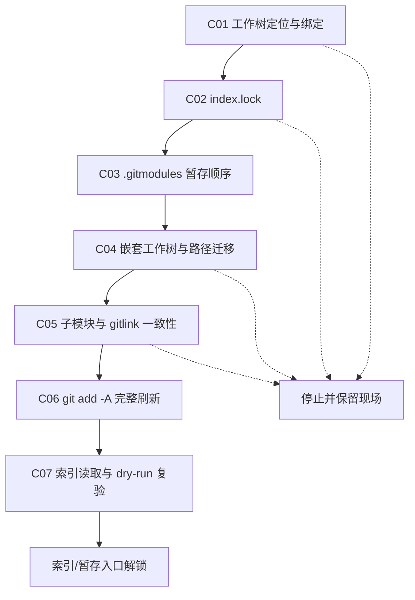

# `【MacOS@SourceTree】📥修复Git无法Commit.command`


[toc]

---

## 🔥 <font id=前言>前言</font>

> 这是一个挂载到 [**Sourcetree**](https://www.sourcetreeapp.com/) 的 [**Git**](https://git-scm.com/) Commit 修复动作。脚本把“无法 Commit”拆成 7 个独立场景，按固定顺序逐项检测、修复和验证；任一安全前提不成立就停止，不把多种 Git 元数据修复混成一次不可追踪的清理。

## 一、脚本覆盖的故障场景与成因 <a href="#前言" style="font-size:17px; color:green;"><b>🔼</b></a> <a href="#🔚" style="font-size:17px; color:green;"><b>🔽</b></a>

| 编号 | 故障现象 | 出现原因 | 独立处理 | 通过判据 |
| --- | --- | --- | --- | --- |
| C01 | Sourcetree 显示 `HEAD`、当前目录无法识别为工作树，或目录改名后仓库失联 | 当前目录的 `.git` 指针仍指向旧 gitdir，gitdir 内的 `core.worktree` 又指向旧路径或另一个真实目录 | 先核对当前路径、gitdir 与 `core.worktree`；旧路径失效时修正绑定，真实旧工作树仍存在时把当前目录转换为独立工作树 | `git rev-parse --show-toplevel` 能从当前目标路径得到真实仓库根目录 |
| C02 | `Unable to create '.git/index.lock': File exists` | Git 索引写进程仍在运行，或 Git / Sourcetree 异常退出后留下残留 `index.lock` | 精确检查锁占用、同仓库索引写进程和锁 inode；活锁立即停止，残留锁移动到备份目录 | 原锁不再阻塞，且现有索引仍可读取 |
| C03 | `please stage your changes to .gitmodules or stash them to proceed`，删除或迁移旧子模块时 Commit 中断 | Sourcetree 先执行 `git rm`，但 `.gitmodules` 的路径变更或删除尚未写入索引，配置与 gitlink 顺序不一致 | 只把 `.gitmodules` 先写入索引，再继续处理 gitlink | `.gitmodules` 的待提交状态已进入索引，Git 不再拒绝后续 gitlink 变更 |
| C04 | 子模块改名/复制后显示 `HEAD`，新目录借用旧 gitdir，或 `.git/core.worktree` 路径错位 | 直接移动/复制目录只改变了文件系统位置，没有同步 `.gitmodules`、`.git/modules`、`core.worktree` 与父仓 gitlink | 扫描嵌套 `.git` 文件；仅在路径、索引登记和远端 URL 能相互验证时修复迁移或创建独立 gitdir | 每个被接管路径都能验证为自身的有效 Git 工作树；无法证明安全时停止 |
| C05 | 父仓显示“未提交的子模块”，但子模块缺失、为空、已迁移、已退役，或父仓锁定提交不可用 | 父仓索引中的模式 `160000` gitlink、`.gitmodules` 和磁盘上的子模块工作树状态不一致 | 初始化缺失工作树、识别同 section 路径迁移、允许已从 `.gitmodules` 移除的旧 gitlink 退役，并保留子模块内部真实修改 | 所有仍有效的 gitlink 都有安全可用的工作树；不安全子模块会阻断全量暂存 |
| C06 | 新增、删除、重命名、文件与同名目录互换时，Sourcetree 的分步 `add` / `rm` 互相阻塞；典型报错为 `not removing ... recursively without -r` | GUI 针对新旧路径分别执行命令，执行顺序无法表达工作树的最终整体状态 | 在前置安全检查通过后统一执行 `git add -A -- .` | 新增、修改和删除被一次性刷新到父仓索引 |
| C07 | 前面看似修好，但下一次 Commit 仍可能再次卡在索引入口 | 修复动作如果不复验，可能只移动了表面阻塞，索引本身仍不可读或暂存入口仍失败 | 检查没有遗留 `index.lock`，执行 `git ls-files --stage` 与 `git add --dry-run -A -- .` | 两项验证均成功，判定“Commit 的索引/暂存入口已解锁” |

### 1.1、C01：工作树绑定错位为什么分两种处理

- 旧 `core.worktree` 路径已经不存在：通常是目录改名后元数据没有同步，脚本可以把 `core.worktree` 改为当前路径。
- 旧 `core.worktree` 路径仍真实存在：说明当前目录可能是复制品或误绑定副本。脚本不会抢占原工作树，而是复制 Git 元数据，让当前目录成为独立工作树，并保留原 `.git` 指针作为备份。

### 1.2、C02：为什么不能直接删除 `index.lock`

`index.lock` 可能代表 `git add`、`git commit`、`git checkout` 等索引写操作仍在进行。直接删除活锁会让两个写进程同时操作索引。脚本只在以下条件全部满足时归档残留锁：

1. 锁是普通文件，不是目录或符号链接。
2. `lsof` 没有发现锁文件持有者。
3. 当前仓库没有仍可能写索引的 Git 进程。
4. 检查前后锁的设备号与 inode 没有变化。
5. 移动锁后 `git ls-files --stage` 仍能读取索引；失败时恢复原锁。

### 1.3、C04 与 C05：脚本怎样保护子模块真实修改

- 父仓只提交 gitlink 指向的子模块提交，不会直接提交子模块工作区里的文件内容。
- 已存在子模块有内部修改时，脚本列出状态并保持原样；它不会执行 `reset`、`clean` 或替用户提交子模块。
- 缺失子模块会按 `.gitmodules` 尝试初始化，因此可能访问子模块远端。
- 父仓锁定提交已被远端历史重写移除时，脚本只保留本轮新克隆工作树的有效 clean `HEAD`；这可能形成依赖版本变化，提交前必须人工核对。

## 二、先分清“无法暂存”与“无法创建提交” <a href="#前言" style="font-size:17px; color:green;"><b>🔼</b></a> <a href="#🔚" style="font-size:17px; color:green;"><b>🔽</b></a>

### 2.1、Commit 界面背后有两段流程

Git 的提交链路不是一个动作：

1. `git add` / `git rm` 把工作区的最终状态写入索引，也就是暂存区。
2. `git commit` 读取索引，运行 Hook 和签名链路，再创建提交对象。

Sourcetree 的 Commit 界面会编排这两段流程，所以界面显示“Commit 失败”，根因可能只是前半段的某条 `git add` 或 `git rm` 失败。本脚本的 C01–C07 主要解锁工作树、Git 元数据、子模块、索引与暂存入口；它不会绕过提交后半段的身份、Hook、签名或冲突规则。

`git add -A -- .` 会在当前仓库范围内统一记录新增、修改和删除；`--` 用于结束选项解析，避免以 `-` 开头的路径被当作命令参数。

### 2.2、错误分流表

| 报错或现象 | 根因方向 | 本脚本是否处理 | 先做什么 |
| --- | --- | --- | --- |
| `nothing to commit` | 索引没有相对 `HEAD` 的变化 | 否 | 查看 `git diff --cached`；确认是否真的有内容需要暂存。 |
| `unmerged files` | merge、rebase、cherry-pick 或 revert 冲突未解决 | 否 | 用 `git status` 找出冲突；解决后 `git add`，再运行对应的 `--continue`。 |
| `Author identity unknown` | `user.name` / `user.email` 缺失 | 否 | 查明配置来源，再决定写仓库级还是全局配置。 |
| `Unable to create '.git/index.lock': File exists` | Git 索引写进程仍在运行，或异常退出留下残留锁 | 是，C02 | 活锁停止处理；只有确认无人占用的残留锁才归档并复验索引。 |
| Hook 返回非零 | `pre-commit`、`commit-msg` 等质量门禁失败 | 否 | 阅读 Hook 原始输出；不要把 `--no-verify` 当成默认修复。 |
| GPG / SSH signing failed | 签名程序、密钥、agent 或 pinentry 异常 | 否 | 检查 `commit.gpgsign`、`gpg.format` 与 signing key。 |
| `.gitmodules` / gitlink 报错 | 子模块配置、路径与索引模式 `160000` 不一致 | 是，C03–C05 | 先核对 `.gitmodules`、gitlink 与子模块工作树，不直接重置。 |
| `not removing ... recursively without -r` | GUI 对文件/目录互换或目录删除做了分步 `git rm` | 是，C06 | 通过完整索引刷新表达工作树的最终整体状态。 |
| `No space left on device` / 只读错误 | 磁盘、配额、挂载或权限问题 | 否 | 先处理系统资源，不要反复重建索引。 |

### 2.3、运行脚本前的只读诊断

先在目标仓库运行：

```shell
git status --short --branch
git diff
git diff --cached
git rev-parse --show-toplevel
git rev-parse --absolute-git-dir
git ls-files -u
git submodule status --recursive
```

- `git diff` 显示尚未暂存的变化；`git diff --cached` 显示真正会进入下一次提交的变化。
- `git ls-files -u` 有输出时表示索引仍有未解决冲突，本脚本不会替用户决定冲突内容。
- `git rev-parse --absolute-git-dir` 能找到当前 worktree 真正使用的 Git 元数据目录；不能固定假设锁一定在仓库根目录的 `.git` 文件夹内。
- `git submodule status --recursive` 用于识别缺失、未初始化或提交指向变化的子模块。

如果错误明确指向 `index.lock`，再做精确锁检查：

```shell
git_dir="$(git rev-parse --absolute-git-dir)"
index_lock="${git_dir}/index.lock"
if [[ -e "$index_lock" ]]; then
  stat -f 'path=%N size=%z inode=%i modified=%Sm' "$index_lock"
  lsof -nP -- "$index_lock"
fi
pgrep -alf git
```

发现锁仍被持有，或存在可能写索引的 Git 进程时，应完成或退出对应操作后再试；不要杀进程，也不要手工删除锁。

### 2.4、身份、Hook 与签名的诊断边界

```shell
git config --show-origin --get-regexp '^user\.(name|email)$'
git config --show-origin --get commit.gpgsign
git config --show-origin --get gpg.format
git config --show-origin --get user.signingkey
git config --show-origin --get core.hooksPath
find "$(git rev-parse --git-path hooks)" -maxdepth 1 -type f -perm -u+x -print
```

- `core.hooksPath` 有输出时，应检查它指向的目录，不能继续假设 Hook 位于默认 `.git/hooks`。
- `git commit --no-verify` 可能绕过团队质量门禁，只能用于已获允许的定位过程，不是长期修复方案。
- `git commit --no-gpg-sign` 可以辅助判断签名链路，但不能用于绕过仓库的强制签名规则。

### 2.5、脚本明确不处理的 Commit 故障

以下问题会保留原始错误并返回失败：

- merge、rebase、cherry-pick 或 revert 的未解决冲突。
- `pre-commit`、`commit-msg` 等 Hook 返回非零。
- `user.name` / `user.email` 缺失。
- GPG / SSH 签名、agent 或 pinentry 故障。
- 文件权限、只读文件系统、磁盘空间或 Git 对象损坏。
- 用户没有任何已暂存变化，Git 返回 `nothing to commit`。

C07 只证明索引可读且暂存入口可用，不承诺上述提交对象创建阶段的问题已经消失。

## 三、逐项试验并解锁的执行流程 <a href="#前言" style="font-size:17px; color:green;"><b>🔼</b></a> <a href="#🔚" style="font-size:17px; color:green;"><b>🔽</b></a>



执行原则：

1. 每个场景都有独立编号、独立函数、出现原因和通过日志。
2. 前一项通过后才进入下一项；任何安全条件失败都会立即返回非零状态。
3. C06 是唯一一次父仓全量索引刷新，不在多个场景里重复执行 `git add -A`。
4. C07 负责最终“解锁”判定；通过后仍需回到 Sourcetree 人工核对暂存范围。

## 四、运行方式 <a href="#前言" style="font-size:17px; color:green;"><b>🔼</b></a> <a href="#🔚" style="font-size:17px; color:green;"><b>🔽</b></a>

### 4.1、Sourcetree 自定义动作

1. 在 Sourcetree 中选中目标仓库。
2. 运行自定义动作 `📥修复Git无法Commit`。
3. 脚本接收 `$REPO` 后无交互连续执行；场景编号、原因、处理结果和停止点会显示在输出窗口。
4. 回到“文件状态”刷新，逐项核对暂存变更后再提交。

### 4.2、终端独立运行

在当前 README 所在目录执行：

```shell
'./【MacOS@SourceTree】📥修复Git无法Commit.command' '/path/to/repository'
```

终端模式会先打印内置自述；按回车确认后才初始化日志并修改 Git 状态，按 `Ctrl+C` 可取消。

## 五、执行后核对与手工回退边界 <a href="#前言" style="font-size:17px; color:green;"><b>🔼</b></a> <a href="#🔚" style="font-size:17px; color:green;"><b>🔽</b></a>

脚本成功后，先刷新 Sourcetree，再核对：

```shell
git status --short --branch
git diff --cached --name-status
git diff --cached -- .gitmodules
git diff --cached --submodule
git ls-files -s | awk '$1 == 160000 { print $2, $4 }'
git_dir="$(git rev-parse --absolute-git-dir)"
if [[ -d "${git_dir}/jobs-stale-lock-backups" ]]; then
  find "${git_dir}/jobs-stale-lock-backups" -maxdepth 1 -type f -name 'index.lock.*.stale' -print
fi
```

验收重点：

1. `git status` 不再报告索引锁、工作树绑定或文件/目录暂存阻塞。
2. `git diff --cached --name-status` 中每一项都是用户准备提交的变化。
3. `.gitmodules` 和模式 `160000` 的 gitlink 变化相互匹配。
4. 子模块内部真实修改仍留在子模块中，没有被脚本清理或替用户提交。
5. 残留锁备份路径与日志一致；备份用于追溯，不需要在正常流程中自动恢复。

如果暂存范围不正确，应在确认具体文件后使用 Sourcetree 或精确的 `git restore --staged -- <path>` 取消对应暂存，再重新核对。不要为了“回退脚本”执行 `git reset --hard` 或 `git clean`，它们会影响真实工作区内容。

## 六、安全边界 <a href="#前言" style="font-size:17px; color:green;"><b>🔼</b></a> <a href="#🔚" style="font-size:17px; color:green;"><b>🔽</b></a>

- 脚本会修改当前仓库的 Git 索引，把所有未忽略的工作区变化放入暂存区。
- 残留锁移动到 `.git/jobs-stale-lock-backups/index.lock.<时间>.stale`，不会直接删除；活锁始终保留。
- 缺失子模块可能触发 `git submodule update --init --recursive` 并访问远端。
- 经验证的子模块路径迁移可能修改 `.gitmodules`、`core.worktree`、父仓新旧 gitlink 和 `.git/modules` 内的元数据。
- 脚本不执行 `git commit`、`git push`、`git reset`、`git clean` 或 `git add -f`。
- 脚本不清理、不暂存、不提交已有子模块内部的真实文件修改。
- 执行后必须在 Sourcetree 检查暂存区；“流程解锁”不等于“所有暂存内容都应该提交”。

## 七、日志文件 <a href="#前言" style="font-size:17px; color:green;"><b>🔼</b></a> <a href="#🔚" style="font-size:17px; color:green;"><b>🔽</b></a>

运行日志写入系统临时目录中的：

```text
【MacOS@SourceTree】📥修复Git无法Commit.log
```

日志包含 C01–C07 的执行顺序、命中原因、备份位置、子模块状态、暂存摘要和最终复验结果。日志可能包含本机路径和远端信息，分享前应脱敏。

## 八、常见问题 <a href="#前言" style="font-size:17px; color:green;"><b>🔼</b></a> <a href="#🔚" style="font-size:17px; color:green;"><b>🔽</b></a>

### 8.1、脚本会直接 Commit 吗？

不会。脚本只处理 Commit 之前的工作树、Git 元数据和暂存区；提交仍由用户在 Sourcetree 中确认后执行。

### 8.2、为什么不是发现一个错误就直接执行所有修复？

不同场景影响的对象不同：`index.lock` 属于并发保护，`.gitmodules` 属于配置与索引顺序，`core.worktree` 属于工作树绑定，gitlink 属于父仓对子模块提交的记录。逐项处理可以在第一个不安全点停止，并明确知道改了什么。

### 8.3、为什么文件与同名目录互换要用 `git add -A -- .`？

Sourcetree 可能针对旧文件、新目录和目录内容分别执行 `add` / `rm`，中间状态会触发递归删除或路径类型冲突。完整索引刷新让 Git 直接观察最终工作树状态，统一记录新增、修改和删除。

### 8.4、为什么 C07 通过后 Sourcetree 仍可能 Commit 失败？

C07 只验证索引和暂存入口。Commit 后半段还可能被 Hook、作者身份、签名、冲突状态、磁盘或权限问题阻断；这些错误会保留原始输出，不由本脚本自动绕过。

### 8.5、为什么还要刷新 Sourcetree？

Git 索引由外部脚本修改后，Sourcetree 界面可能仍缓存旧文件列表。刷新后才能看到真实暂存状态。

<a id="🔚" href="#前言" style="font-size:17px; color:green; font-weight:bold;">我是有底线的➤点我回到首页</a>
