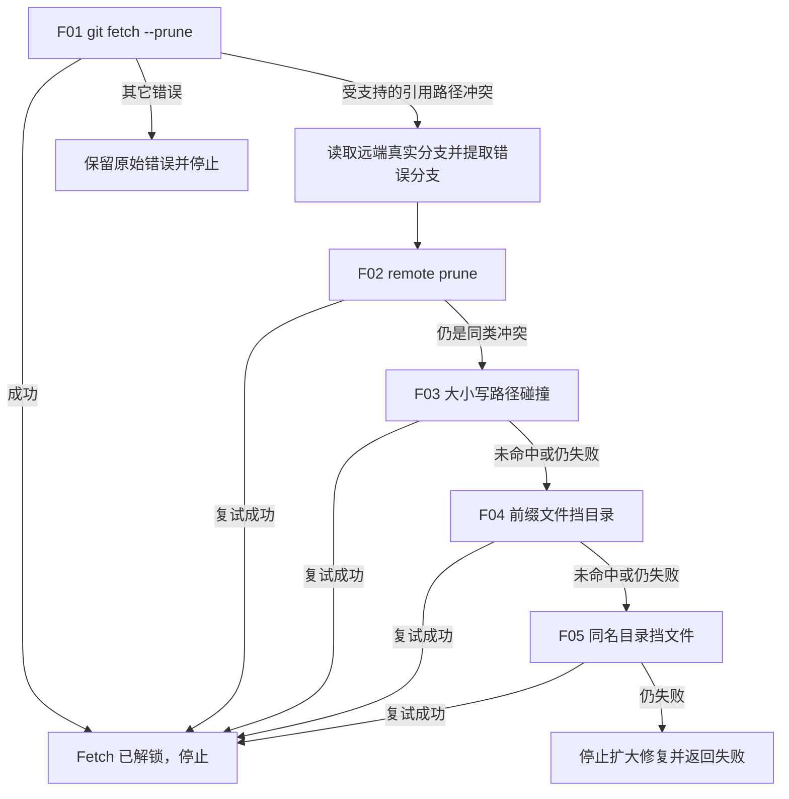

# `【MacOS@SourceTree】📥修复Git无法Fetch.command`


[toc]

---

## 🔥 <font id=前言>前言</font>

> 这是一个挂载到 [**Sourcetree**](https://www.sourcetreeapp.com/) 的 [**Git**](https://git-scm.com/) Fetch 修复动作。脚本把安全可自动处理的远端跟踪引用故障拆成 5 个独立场景；每处理一项就立即重新 Fetch，成功后停止后续元数据修复。

## 一、脚本覆盖的故障场景与成因 <a href="#前言" style="font-size:17px; color:green;"><b>🔼</b></a> <a href="#🔚" style="font-size:17px; color:green;"><b>🔽</b></a>

| 编号 | 故障现象 | 出现原因 | 独立处理 | 解锁判据 |
| --- | --- | --- | --- | --- |
| F01 | 普通 Fetch 失败前没有明确的元数据诊断，或只是可由 Git 自己清理的 stale ref | 远端有正常更新，或失效远端跟踪引用尚未随 Fetch 清理 | 首先原样执行 `git fetch --prune <remote>`，不预先移动任何 Git 元数据 | Fetch 返回 0 时立即结束，F02–F05 全部跳过 |
| F02 | Fetch 输出仍指向旧 remote-tracking ref / reflog | 远端分支已删除或改名，本地 `refs/remotes`、`logs/refs/remotes` 或 packed 状态尚未完整清理 | 执行 `git remote prune <remote>`，让 Git 先按远端真值清理，再立即 Fetch | prune 后的 Fetch 返回 0 |
| F03 | 远端存在 `SaaS` 与 `saas/...` 等只有大小写差异的分支前缀，MacOS 上 Fetch 报路径冲突 | 远端大小写敏感文件系统允许这些引用并存；MacOS 默认大小写不敏感文件系统会把它们映射到同一路径 | 通过 `git ls-remote --heads` 验证远端真值；用 `git pack-refs --all` 保留有效引用并按 Git 默认行为释放 loose ref 路径，再备份碰撞 reflog 并立即 Fetch | packed ref 与层级 loose ref 能同时读取，Fetch 返回 0 |
| F04 | `refs/remotes/...` 或 `logs/refs/remotes/...` 报 `Not a directory`、`exists; cannot create` | 远端从单层分支 `foo` 迁移到层级分支 `foo/bar`；本地旧 `foo` 是文件，新引用却要求它成为目录 | 只针对错误明确点名的 `foo/bar`，备份其前缀位置上的 loose ref/reflog 文件，再立即 Fetch | 前缀文件移开后的 Fetch 返回 0 |
| F05 | Fetch 需要创建单层引用文件，但同名位置仍是目录 | 远端从层级分支 `foo/bar` 收口为单层分支 `foo`；本地旧 `foo/` 引用目录或 reflog 目录仍存在 | 只针对错误明确点名的 `foo`，备份同名 loose ref/reflog 目录，再立即 Fetch | 同名目录移开后的 Fetch 返回 0 |

### 1.1、为什么 `refs/remotes` 与 `logs/refs/remotes` 要分开检查

- `refs/remotes/<remote>/...` 保存远端跟踪引用的当前指向。
- `logs/refs/remotes/<remote>/...` 保存这些引用的本地 reflog。
- 其中任意一侧残留文件或目录，都可能单独造成文件/目录冲突。脚本只移动本次错误分支路径上的实际阻塞项，不删除整个远端引用目录。
- F03 使用 Git 原生 `pack-refs` 把有效引用从 loose 文件收进 `packed-refs`；引用 OID 不变，但文件系统上的大小写前缀被释放，之后才能创建另一个大小写层级目录。

### 1.2、为什么每个场景修复后立刻 Fetch

每次 `git fetch --prune` 都是真实“解锁试验”。如果 F02 已经解决问题，就没有理由继续进入大小写或文件/目录元数据处理；只有最近一次 Fetch 仍返回同类受支持错误，脚本才刷新冲突分支并进入下一项。

### 1.3、什么叫 D/F conflict

D/F 是 Directory/File 的缩写。Git 引用名会映射为层级路径：

- `origin/foo` 通常对应一个引用文件。
- `origin/foo/bar` 要求 `foo` 是目录、`bar` 是引用文件。

同一路径不可能同时既是文件又是目录，因此上游在 `foo` 与 `foo/bar` 之间迁移后，本地旧 remote-tracking 元数据可能阻止新形态落盘。

## 二、Fetch 原理、最小诊断与错误分流 <a href="#前言" style="font-size:17px; color:green;"><b>🔼</b></a> <a href="#🔚" style="font-size:17px; color:green;"><b>🔽</b></a>

### 2.1、Fetch 与 Pull 不是一回事

`git fetch` 下载远端对象，并按照 refspec 更新本地引用；常见映射是：

```ini
[remote "origin"]
  fetch = +refs/heads/*:refs/remotes/origin/*
```

因此，即使工作区完全干净，Fetch 仍会写入 `FETCH_HEAD`、远端跟踪引用、reflog、对象与维护数据。Fetch 不会自动把远端提交合并进当前本地分支；Pull 才会在 Fetch 之后继续执行 merge 或 rebase。

本脚本只处理 Fetch 阶段的远端跟踪引用与 reflog 路径阻塞，不处理 Pull 后半段的分支分叉、工作区覆盖或 merge/rebase 冲突。

### 2.2、运行脚本前的最小诊断

以 `origin` 为例：

```shell
git remote -v
git remote get-url --all origin
git ls-remote --heads origin
git fetch --prune origin
git for-each-ref --format='%(refname) %(objectname)' refs/remotes/origin/
```

- 前两条确认 Sourcetree 实际访问的远端名称与 URL。
- `git ls-remote --heads` 直接读取远端真实分支，可区分“远端真有大小写碰撞”与“只有本地缓存异常”。它需要正常网络和认证。
- `git fetch --prune` 是基线复现，也是 F01 的真实解锁试验；它会更新远端跟踪状态，不是只读命令。
- `git for-each-ref` 用 Git 自己的引用接口查看本地状态，比直接假设所有引用都存在于 `.git/refs` 更可靠，因为引用也可能保存在 `packed-refs`。

### 2.3、错误分流表

| 报错或现象 | 根因方向 | 本脚本是否处理 | 先做什么 |
| --- | --- | --- | --- |
| `Could not resolve host` | DNS、网络或代理 | 否 | 检查域名解析、网络与 Git 代理配置。 |
| `Connection timed out` / `Connection refused` | 网络、端口、防火墙或远端服务不可用 | 否 | 核对 HTTPS/SSH 端口及远端服务状态。 |
| `Permission denied (publickey)` | SSH key、agent、Host 配置或账号权限 | 否 | 使用 `ssh -vT <host>` 定位密钥选择，不要先重建全部密钥。 |
| HTTP `401` / `403` | Token、SSO、权限或组织策略 | 否 | 核对凭据来源、Token 权限、有效期和 SSO 授权。 |
| `repository not found` | URL 错误、仓库已移动/删除，或无权读取私有仓库 | 否 | 对照 `git remote get-url --all <remote>` 与托管平台。 |
| `cannot lock ref` 并明确指向 `.lock` | 并发进程或旧锁 | 否 | 先确认 Git/Sourcetree 进程；本脚本不会移动真实引用锁。 |
| `refs/remotes/...` + `Not a directory` | 单层分支迁移为层级分支，旧引用文件挡住目录 | 是，F02/F04 | 让脚本先 prune，再精确备份错误前缀。 |
| `exists; cannot create` / `Is a directory` | 层级分支收口为单层分支，或大小写路径碰撞 | 是，F02/F03/F05 | 对比远端真实分支与本地 refs，再按错误路径逐项复试。 |
| `bad object` / `missing blob` | 对象库或引用损坏 | 否 | 先备份并用 `git fsck --full` 诊断，必要时重新克隆对比。 |
| `No space left on device` / 只读错误 | 磁盘空间、配额、挂载或权限问题 | 否 | 先修复系统资源，不要继续移动引用。 |

### 2.4、脚本明确不处理的 Fetch 故障

以下问题会保留原始错误并返回失败，不自动尝试旁路：

- 网络中断、DNS、代理、TLS / SSL 或 SSH 连接失败。
- 密码、Token、SSO、权限、远端 URL 错误或仓库不存在。
- `cannot lock ref` 指向真实 `.lock` 并发占用，而不是引用文件/目录冲突。
- 磁盘空间不足、只读文件系统、权限异常或对象库损坏。
- 自定义 refspec、服务器拒绝、远端服务故障。
- Pull 的 merge / rebase 冲突、本地分支分叉或工作区冲突。

只有 Fetch 输出同时明确指向 `refs/remotes/...` 或 `logs/refs/remotes/...`，并命中 `Not a directory`、`Is a directory`、`exists; cannot create`、`cannot create ... directory` 等路径冲突特征时，F02–F05 才会启动。

## 三、逐项试验并解锁的执行流程 <a href="#前言" style="font-size:17px; color:green;"><b>🔼</b></a> <a href="#🔚" style="font-size:17px; color:green;"><b>🔽</b></a>



安全顺序：

1. F01 永远先运行；普通 Fetch 能成功时不创建备份目录。
2. F01 失败后，通过 `git ls-remote --heads` 读取远端真实分支，不能只相信本地缓存。
3. 每次只使用最近一次 Fetch 错误明确点名的目标分支。
4. F02–F05 每产生一次实际修复就立即 Fetch；成功后剩余场景函数只返回，不再扫描或移动元数据。
5. 5 个场景全部未解锁时返回非零状态，已经移动的对象仍保留在备份区，不自动删除。

备份目录位于目标仓库的 Git 元数据内：

```text
.git/jobs-ref-conflict-backups/YYYYMMDD-HHMMSS-PID/
├── refs/remotes/...
└── logs/refs/remotes/...
```

## 四、运行方式 <a href="#前言" style="font-size:17px; color:green;"><b>🔼</b></a> <a href="#🔚" style="font-size:17px; color:green;"><b>🔽</b></a>

### 4.1、Sourcetree 自定义动作

1. 在 Sourcetree 中选中目标仓库。
2. 运行自定义动作 `📥修复Git无法Fetch`。
3. 脚本使用 `$REPO` 识别仓库，默认处理 `origin`。
4. Sourcetree 模式不等待回车；输出窗口会显示 F01–F05 的原因、是否命中、每次 Fetch 复试和最终结果。

### 4.2、终端独立运行

默认使用仓库的 `origin`：

```shell
'./【MacOS@SourceTree】📥修复Git无法Fetch.command' '/path/to/repository'
```

显式指定其它远端：

```shell
'./【MacOS@SourceTree】📥修复Git无法Fetch.command' '/path/to/repository' 'upstream'
```

终端模式会先打印内置自述；按回车确认后才初始化日志并执行 Fetch，按 `Ctrl+C` 可取消。

## 五、执行后核对与手工恢复边界 <a href="#前言" style="font-size:17px; color:green;"><b>🔼</b></a> <a href="#🔚" style="font-size:17px; color:green;"><b>🔽</b></a>

脚本成功后核对：

```shell
git for-each-ref --format='%(refname) %(objectname)' refs/remotes/
git remote show <remote>
git status --short --branch
```

验收重点：

1. 最后一次 `git fetch --prune <remote>` 返回 0；这是脚本的真正解锁判据。
2. `git for-each-ref` 能同时读取 packed 与 loose 的远端跟踪引用。
3. `git remote show <remote>` 不再报告本次已处理的 stale 路径。
4. 当前本地分支、索引和工作区没有被脚本改写；`git status` 仅用于复核，不要求仓库必须干净。
5. 日志记录的备份位于真实 gitdir 下的 `jobs-ref-conflict-backups`，不是固定假设的仓库根目录 `.git`。

脚本不会自动恢复备份。分支层级迁移时，备份项通常已经失效；大小写碰撞时，备份项也可能仍对应有效远端分支。若必须手工恢复，应先确认远端当前真值和 `packed-refs` 状态，再只处理日志记录的精确路径。不要删除整个 `refs/remotes/<remote>` 或 `logs/refs/remotes/<remote>` 来碰运气。

## 六、安全边界 <a href="#前言" style="font-size:17px; color:green;"><b>🔼</b></a> <a href="#🔚" style="font-size:17px; color:green;"><b>🔽</b></a>

- 脚本会更新远端跟踪引用，这是 Fetch 本身的正常行为。
- 脚本不执行 `git pull`、`merge`、`rebase`、`git add`、`git commit`、`git push`、`git reset` 或 `git checkout`。
- 脚本不修改工作区、Git 索引、本地分支指向或提交历史。
- 冲突元数据不直接删除，而是移入 `.git/jobs-ref-conflict-backups` 便于追溯。
- F03 会执行 Git 原生 `git pack-refs --all`，它可能把本地分支、标签和远端跟踪引用统一改为 packed 存储，并按默认行为清理已打包的 loose refs；引用指向与提交历史不变。
- 脚本的手工备份只处理错误明确点名分支的 loose ref/reflog，不清空整个 `refs/remotes/<remote>`。
- 大小写碰撞时，被备份对象可能仍对应远端有效分支；彻底解决需要上游统一分支大小写命名。
- 最近一次 Fetch 如果转为网络、认证、并发锁等其它错误，脚本立即停止，不继续尝试下一种元数据修复。

## 七、日志文件 <a href="#前言" style="font-size:17px; color:green;"><b>🔼</b></a> <a href="#🔚" style="font-size:17px; color:green;"><b>🔽</b></a>

运行日志写入系统临时目录中的：

```text
【MacOS@SourceTree】📥修复Git无法Fetch.log
```

日志记录远端选择、F01–F05 场景顺序、每次 Fetch 输出、错误分支、备份路径、阻塞项数量和最终退出结果。日志可能包含本机路径及远端信息，分享前应脱敏。

## 八、常见问题 <a href="#前言" style="font-size:17px; color:green;"><b>🔼</b></a> <a href="#🔚" style="font-size:17px; color:green;"><b>🔽</b></a>

### 8.1、没有冲突时运行会怎样？

只执行 F01 的正常 `git fetch --prune`。成功后 F02–F05 自动跳过，不创建元数据备份目录。

### 8.2、脚本会自动恢复备份吗？

不会。分支层级迁移时，备份对象通常已经失效；大小写碰撞时，它也可能仍对应有效远端分支。脚本保留现场，避免自动恢复后重新制造相同路径阻塞。

### 8.3、为什么不删除整个 `refs/remotes/origin`？

远端跟踪引用可以重新 Fetch，但 reflog 可能承载排错证据；多 worktree、packed refs、自定义 refspec 和多个远端也可能让整目录删除扩大影响。脚本只处理错误点名分支的实际阻塞路径。

### 8.4、大小写碰撞修复后还可能再出现吗？

可能。远端同时保留 `SaaS` 和 `saas/...` 本身就与 MacOS 默认大小写不敏感文件系统存在映射冲突。脚本只能解开当前 Fetch；上游再次更新碰撞分支时仍可能重现。

### 8.5、为什么 Commit 和 Fetch 要保留为两个脚本？

Commit 修复处理工作树、索引、`.gitmodules`、gitlink 和子模块；Fetch 修复处理远端跟踪引用与 reflog。两者影响边界和验收命令不同，分开更容易停止、追溯和验证。

<a id="🔚" href="#前言" style="font-size:17px; color:green; font-weight:bold;">我是有底线的➤点我回到首页</a>
