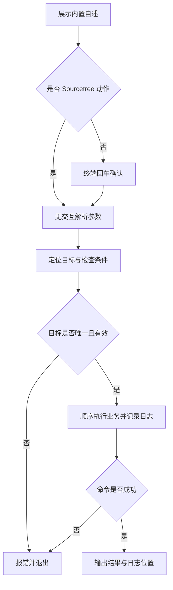

# `【MacOS@SourceTree】📦双击打包Flutter.android.command`


[toc]

---

## 🔥 <font id=前言>前言</font>

这是 [**Sourcetree**](https://www.sourcetreeapp.com/) 的 [**Flutter**](https://flutter.dev/) 工程动作。构建选定 Flutter 工程的 APK、AAB 或两种产物，保留构建失败状态和实时日志。

## 一、运行方式 <a href="#前言" style="font-size:17px; color:green;"><b>🔼</b></a> <a href="#🔚" style="font-size:17px; color:green;"><b>🔽</b></a>

在 Sourcetree 已安装的动作中传入 `$REPO`。系统终端独立运行先打印脚本内置自述，按回车继续，按 `Ctrl+C` 取消；运行时不读取 README。Sourcetree 身份通过环境变量或父进程确认，非 TTY 本身不会绕过确认。

```shell
zsh "./【MacOS@SourceTree】📦双击打包Flutter.android.command" "<工程目录>"
```

`[工程路径] [--target apk|appbundle|all] [--mode release|debug|profile] [--flavor 名称]`。默认 apk / release，无 flavor；环境变量同名支持覆盖，命令行优先。`HEARTBEAT_SECS` 默认 15，必须为正整数；`OPEN_AFTER_BUILD=0` 关闭自动打开目录。

自述与确认阶段只输出到屏幕；确认后才初始化日志。非 Sourcetree 且没有交互输入时直接退出，不执行工程业务。

## 二、执行前检查 <a href="#前言" style="font-size:17px; color:green;"><b>🔼</b></a> <a href="#🔚" style="font-size:17px; color:green;"><b>🔽</b></a>

需要 Flutter SDK、可调用的 [**Java**](https://www.java.com/) 17、工程 `android/gradlew` 和有效 Android SDK。沿用 JDK 17 基线；其他主版本必须先按工程 Gradle / AGP 兼容性单独确认。

路径支持中文、空格和拖拽外层引号。需要递归定位的工程动作会排除依赖、缓存和构建目录；多个工程候选时应直接指定目标。

## 三、实际执行流程 <a href="#前言" style="font-size:17px; color:green;"><b>🔼</b></a> <a href="#🔚" style="font-size:17px; color:green;"><b>🔽</b></a>

递归定位时排除依赖 / 缓存 / 构建目录，多工程要求明确路径。前台构建管道启用 PIPE_FAIL，后台只输出心跳；命令或日志写入失败都会停止。APK 位于工程 `build/app/outputs/flutter-apk/`，AAB 位于 `build/app/outputs/bundle/` 的实际 flavor / mode 子目录。

```shell
flutter pub get
flutter build apk --release
# 或 flutter build appbundle --release
# 可追加 --flavor 名称
```

## 四、风险与失败处理 <a href="#前言" style="font-size:17px; color:green;"><b>🔼</b></a> <a href="#🔚" style="font-size:17px; color:green;"><b>🔽</b></a>

会联网解析依赖、调用工程 Gradle 并写入构建目录。签名与发布配置由工程负责；不自动升级 SDK、JDK、Gradle、AGP 或依赖版本。

Sourcetree 不发起输入等待；无法安全确定目标或缺少必要条件时直接报错。外部命令失败返回非零状态，后续业务停止。脚本及外部输出在受限输出窗口使用纯文本。

## 五、日志与产物 <a href="#前言" style="font-size:17px; color:green;"><b>🔼</b></a> <a href="#🔚" style="font-size:17px; color:green;"><b>🔽</b></a>

执行日志位于系统临时目录，文件名为 `【MacOS@SourceTree】📦双击打包Flutter.android.log`。终端和 Sourcetree 都会打印实际日志位置。构建详情另写入同目录的 `.build.log` 文件。

## 六、验证边界 <a href="#前言" style="font-size:17px; color:green;"><b>🔼</b></a> <a href="#🔚" style="font-size:17px; color:green;"><b>🔽</b></a>

已以假 Flutter / Java 验证失败传播、构建停止、apk / appbundle / all 参数、缺失选项值、心跳参数、FVM 优先级与产物存在性；未执行真实 Gradle 构建。

已通过 `zsh -n` 静态语法检查。 入口已隔离验证非交互拒绝、确认前不创建日志、`NO_COLOR` 空值降级与业务失败退出码传播。隔离夹具验证没有运行真实 Flutter / Xcode 构建、安装、依赖清理或模拟器操作；真实工程的签名、网络和工具版本仍需按运行日志确认。

## 七、流程图 <a href="#前言" style="font-size:17px; color:green;"><b>🔼</b></a> <a href="#🔚" style="font-size:17px; color:green;"><b>🔽</b></a>



<a id="🔚" href="#前言" style="font-size:17px; color:green; font-weight:bold;">我是有底线的➤点我回到首页</a>
