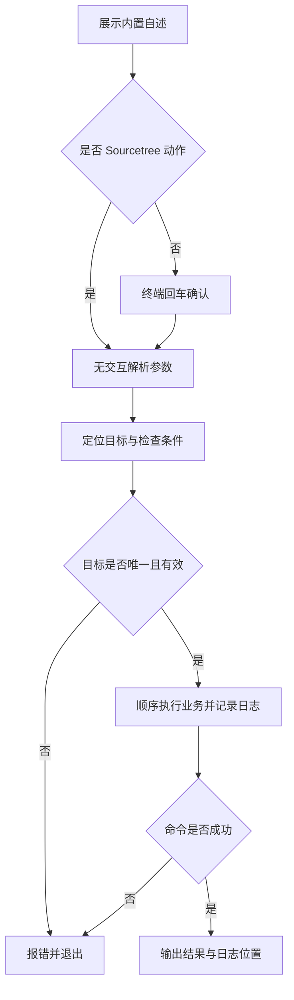

# `【MacOS@SourceTree】📦双击打包Flutter.iOS.command`


[toc]

---

## 🔥 <font id=前言>前言</font>

这是 [**Sourcetree**](https://www.sourcetreeapp.com/) 的 [**Flutter**](https://flutter.dev/) 工程动作。对选定 Flutter 工程执行 `flutter build ipa`，输出 IPA 或明确提示只有 xcarchive。

## 一、运行方式 <a href="#前言" style="font-size:17px; color:green;"><b>🔼</b></a> <a href="#🔚" style="font-size:17px; color:green;"><b>🔽</b></a>

在 Sourcetree 已安装的动作中传入 `$REPO`。系统终端独立运行先打印脚本内置自述，按回车继续，按 `Ctrl+C` 取消；运行时不读取 README。Sourcetree 身份通过环境变量或父进程确认，非 TTY 本身不会绕过确认。

```shell
zsh "./【MacOS@SourceTree】📦双击打包Flutter.iOS.command" "<工程目录>"
```

`[工程路径] [--mode release|debug|profile] [--flavor 名称]`，默认 release。`HEARTBEAT_SECS` 默认 15，必须为正整数；`OPEN_AFTER_BUILD=0` 关闭自动打开。iOS 不接受 `--target`。

自述与确认阶段只输出到屏幕；确认后才初始化日志。非 Sourcetree 且没有交互输入时直接退出，不执行工程业务。

## 二、执行前检查 <a href="#前言" style="font-size:17px; color:green;"><b>🔼</b></a> <a href="#🔚" style="font-size:17px; color:green;"><b>🔽</b></a>

需要对应 Flutter SDK 与可调用的 [**Xcode**](https://developer.apple.com/xcode/)；工程含 `ios/Podfile` 时要求 [**CocoaPods**](https://cocoapods.org/) 可用。签名、证书和导出配置需由工程预先准备。

路径支持中文、空格和拖拽外层引号。需要递归定位的工程动作会排除依赖、缓存和构建目录；多个工程候选时应直接指定目标。

## 三、实际执行流程 <a href="#前言" style="font-size:17px; color:green;"><b>🔼</b></a> <a href="#🔚" style="font-size:17px; color:green;"><b>🔽</b></a>

前台管道保留失败退出码，后台只展示心跳，退出时停止心跳。IPA 位于工程 `build/ios/ipa/`；只有 `build/ios/archive/*.xcarchive` 时明确报告导出尚未完成；两者都不存在则返回失败。

```shell
xcodebuild -version
flutter pub get
flutter build ipa --release
# 可追加 --flavor 名称
```

## 四、风险与失败处理 <a href="#前言" style="font-size:17px; color:green;"><b>🔼</b></a> <a href="#🔚" style="font-size:17px; color:green;"><b>🔽</b></a>

会解析依赖并调用 Xcode 构建与签名。不会绕过签名、自动安装开发工具或更改全局环境。具体导出要求见 [Flutter 官方 iOS 发布说明](https://docs.flutter.dev/deployment/ios)。

Sourcetree 不发起输入等待；无法安全确定目标或缺少必要条件时直接报错。外部命令失败返回非零状态，后续业务停止。脚本及外部输出在受限输出窗口使用纯文本。

## 五、日志与产物 <a href="#前言" style="font-size:17px; color:green;"><b>🔼</b></a> <a href="#🔚" style="font-size:17px; color:green;"><b>🔽</b></a>

执行日志位于系统临时目录，文件名为 `【MacOS@SourceTree】📦双击打包Flutter.iOS.log`。终端和 Sourcetree 都会打印实际日志位置。构建详情另写入同目录的 `.build.log` 文件。

## 六、验证边界 <a href="#前言" style="font-size:17px; color:green;"><b>🔼</b></a> <a href="#🔚" style="font-size:17px; color:green;"><b>🔽</b></a>

已用假 SDK / Xcode 验证 pub get 和 build 失败传播、选项错误提前拒绝、IPA / archive 路径检查和终止后心跳清理；未执行真实签名构建。

已通过 `zsh -n` 静态语法检查。 入口已隔离验证非交互拒绝、确认前不创建日志、`NO_COLOR` 空值降级与业务失败退出码传播。隔离夹具验证没有运行真实 Flutter / Xcode 构建、安装、依赖清理或模拟器操作；真实工程的签名、网络和工具版本仍需按运行日志确认。

## 七、流程图 <a href="#前言" style="font-size:17px; color:green;"><b>🔼</b></a> <a href="#🔚" style="font-size:17px; color:green;"><b>🔽</b></a>



<a id="🔚" href="#前言" style="font-size:17px; color:green; font-weight:bold;">我是有底线的➤点我回到首页</a>
