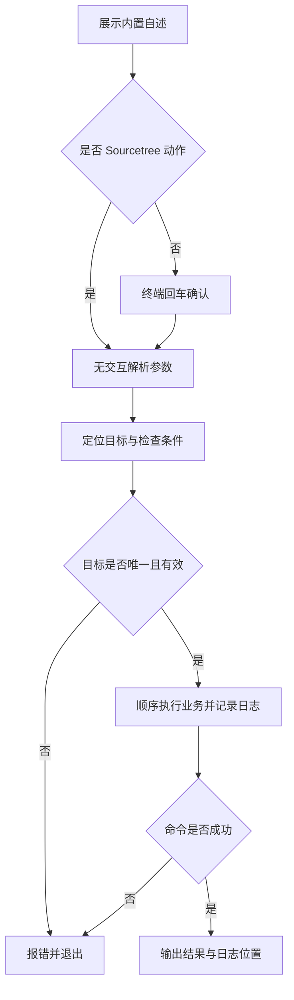

# `【MacOS@SourceTree】📦双击自动生成ipa文件.command`


[toc]

---

## 🔥 <font id=前言>前言</font>

这是 [**Sourcetree**](https://www.sourcetreeapp.com/) 的现有真机 App 打包动作。把已经构建好的 iPhoneOS 真机 App 重新封装为 IPA，避免误取其它 [**Xcode**](https://developer.apple.com/xcode/) 工程的产物。

## 一、运行方式 <a href="#前言" style="font-size:17px; color:green;"><b>🔼</b></a> <a href="#🔚" style="font-size:17px; color:green;"><b>🔽</b></a>

在 Sourcetree 已安装的动作中传入 `$REPO`。系统终端独立运行先打印脚本内置自述，按回车继续，按 `Ctrl+C` 取消；运行时不读取 README。Sourcetree 身份通过环境变量或父进程确认，非 TTY 本身不会绕过确认。

```shell
zsh "./【MacOS@SourceTree】📦双击自动生成ipa文件.command" "<工程目录>"
```

`[仓库目录] [--project 工程.xcodeproj或工作区.xcworkspace] [--app 真机.app] [--config Debug|Release] [--out 输出目录]`，默认 Release、桌面。`--app` 直接选定 App；否则通过选定工程匹配 DerivedData。

自述与确认阶段只输出到屏幕；确认后才初始化日志。非 Sourcetree 且没有交互输入时直接退出，不执行工程业务。

## 二、执行前检查 <a href="#前言" style="font-size:17px; color:green;"><b>🔼</b></a> <a href="#🔚" style="font-size:17px; color:green;"><b>🔽</b></a>

使用 [**macOS**](https://www.apple.com/macos/) 自带 `PlistBuddy`、`ditto`、`zip`。不会调用 `xcodebuild` 或重新签名。

```shell
zsh "./【MacOS@SourceTree】📦双击自动生成ipa文件.command" "<仓库目录>" --config Release
zsh "./【MacOS@SourceTree】📦双击自动生成ipa文件.command" --app "<真机.app>" --out "./输出目录"
```

## 三、实际执行流程 <a href="#前言" style="font-size:17px; color:green;"><b>🔼</b></a> <a href="#🔚" style="font-size:17px; color:green;"><b>🔽</b></a>

通过 DerivedData 的 WorkspacePath 匹配选定工程，只有对应配置的真机 App 可以被自动选择。路径使用 NUL 分隔，兼容空格和中文；模拟器 App 被拒绝。每次创建全新 Payload 与 Zip，避免旧 IPA 的陈旧文件残留。输出使用 App 名称、可读时间与随机后缀，不覆盖已有 IPA；临时目录退出时清理。

```shell
# 确认 DerivedData/Info.plist 的 WorkspacePath 属于选定工程
# 验证 iPhoneOS 平台、APPL 类型和 CFBundleExecutable
ditto "<真机App>" "<本次临时目录>/Payload/<App名称>"
zip -qry "<本次临时目录>/output.ipa" Payload
```

## 四、风险与失败处理 <a href="#前言" style="font-size:17px; color:green;"><b>🔼</b></a> <a href="#🔚" style="font-size:17px; color:green;"><b>🔽</b></a>

只重新打包现有 App，能否安装取决于现有证书、描述文件和设备授权；不等同 App Store 导出。不会从 Release 自动回退 Debug，多个 App 或工程候选必须显式选择。

Sourcetree 不发起输入等待；无法安全确定目标或缺少必要条件时直接报错。外部命令失败返回非零状态，后续业务停止。脚本及外部输出在受限输出窗口使用纯文本。

## 五、日志与产物 <a href="#前言" style="font-size:17px; color:green;"><b>🔼</b></a> <a href="#🔚" style="font-size:17px; color:green;"><b>🔽</b></a>

执行日志位于系统临时目录，文件名为 `【MacOS@SourceTree】📦双击自动生成ipa文件.log`。终端和 Sourcetree 都会打印实际日志位置。

## 六、验证边界 <a href="#前言" style="font-size:17px; color:green;"><b>🔼</b></a> <a href="#🔚" style="font-size:17px; color:green;"><b>🔽</b></a>

已用隔离工程与真实 plist / Zip 验证跨工程 App 排除、指定配置、中文空格路径、模拟器拒绝、无匹配 / 多候选拒绝和 IPA Payload 内容；未执行构建或签名。

已通过 `zsh -n` 静态语法检查。 入口已隔离验证非交互拒绝、确认前不创建日志、`NO_COLOR` 空值降级与业务失败退出码传播。隔离夹具验证没有运行真实 Flutter / Xcode 构建、安装、依赖清理或模拟器操作；真实工程的签名、网络和工具版本仍需按运行日志确认。

## 七、流程图 <a href="#前言" style="font-size:17px; color:green;"><b>🔼</b></a> <a href="#🔚" style="font-size:17px; color:green;"><b>🔽</b></a>



<a id="🔚" href="#前言" style="font-size:17px; color:green; font-weight:bold;">我是有底线的➤点我回到首页</a>
