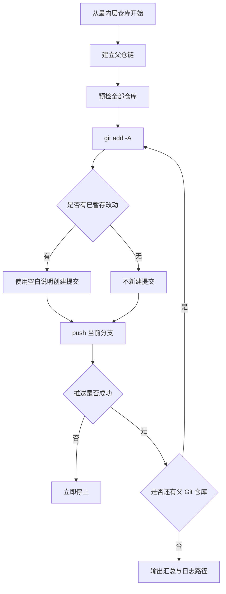

# `【MacOS@SourceTree】🚀逐层空白提交并Push.command`


[toc]

---

## 🔥 <font id=前言>前言</font>

> 用一次 [**Sourcetree**](https://www.sourcetreeapp.com/) 自定义动作，从当前小仓库开始，按“提交、推送、刷新父仓 gitlink”的顺序逐层处理，直到最外层 [**Git**](https://git-scm.com/) 仓库。

## 一、脚本用途 <a href="#前言" style="font-size:17px; color:green;"><b>🔼</b></a> <a href="#🔚" style="font-size:17px; color:green;"><b>🔽</b></a>

- 暂存当前层仓库的全部已跟踪、未跟踪和删除改动。
- 有改动时创建“提交说明为空白”的正常提交；没有改动时不制造无意义的空提交。
- 无论是否新建提交，都会尝试推送当前分支，因此可以补推本地已有的未推送提交。
- 当前层推送成功后才进入父仓，使父仓提交的 gitlink 指向已经上传的子仓提交。
- 只处理“起始仓库 → 父仓 → 更外层父仓”这条链，不扫描、不推送无关兄弟仓库。

## 二、适用场景 <a href="#前言" style="font-size:17px; color:green;"><b>🔼</b></a> <a href="#🔚" style="font-size:17px; color:green;"><b>🔽</b></a>

- 大 Git 仓库内以子模块或独立 `.git` 目录嵌套小 Git 仓库。
- 个人项目允许留空 commit message，并希望一次动作完成整条父仓链推送。
- 从最内层项目发起动作。如果直接从外层项目发起，脚本只处理该外层项目，不反向遍历内部所有仓库。

## 三、运行方式 <a href="#前言" style="font-size:17px; color:green;"><b>🔼</b></a> <a href="#🔚" style="font-size:17px; color:green;"><b>🔽</b></a>

### 3.1、Sourcetree 自定义动作

1、在最内层项目上打开“自定义操作”。

2、选择“🚀逐层空白提交并Push（识别父Git）”。

3、Sourcetree 传入 `$REPO` 后，脚本以纯文本日志、无交互方式连续执行。

### 3.2、终端独立运行

```shell
chmod +x './【MacOS@SourceTree】🚀逐层空白提交并Push.command'
'./【MacOS@SourceTree】🚀逐层空白提交并Push.command' '/path/to/innermost-repository'
```

终端模式首先展示内置自述，并等待回车确认；确认前不改动 Git 索引。

## 四、执行前检查 <a href="#前言" style="font-size:17px; color:green;"><b>🔼</b></a> <a href="#🔚" style="font-size:17px; color:green;"><b>🔽</b></a>

- 每层必须处于正常本地分支，游离 HEAD 时立即停止。
- 每层不能存在未解决冲突、未完成的 merge、rebase、cherry-pick、revert 或 bisect。
- 每层必须已配置 upstream；未配置时，脚本只在存在 `origin` 或唯一远端时自动建立关联。
- 预检会在任何 `git add` 前覆盖整条父仓链；其中任意一层不满足条件，整个流程都不开始。

## 五、执行流程 <a href="#前言" style="font-size:17px; color:green;"><b>🔼</b></a> <a href="#🔚" style="font-size:17px; color:green;"><b>🔽</b></a>



## 六、风险说明 <a href="#前言" style="font-size:17px; color:green;"><b>🔼</b></a> <a href="#🔚" style="font-size:17px; color:green;"><b>🔽</b></a>

- `git add -A` 会把当前层仓库范围内的全部可跟踪改动放入同一个提交，包括新增、修改和删除。
- 脚本不执行 `pull`、`fetch`、`rebase`、强制推送或历史改写。远端存在新提交时，正常 push 会失败并停止。
- 脚本不绕过 Git hooks，也不关闭提交签名。项目本身禁止空白提交说明时，会在该层失败并停止。
- 如果下层已经提交但 push 失败，该本地提交会保留；上层不会被继续处理。

## 七、日志文件 <a href="#前言" style="font-size:17px; color:green;"><b>🔼</b></a> <a href="#🔚" style="font-size:17px; color:green;"><b>🔽</b></a>

终端输出与 Git 命令结果同步写入系统临时目录中的 `【MacOS@SourceTree】🚀逐层空白提交并Push.log`。

## 八、常见问题 <a href="#前言" style="font-size:17px; color:green;"><b>🔼</b></a> <a href="#🔚" style="font-size:17px; color:green;"><b>🔽</b></a>

### 8.1、为什么没有自动扫描所有子仓？

自动遍历兄弟仓会把与当前任务无关的项目也提交并推送。从最内层项目发起，可以让处理范围精确落在当前父仓链。

### 8.2、为什么某层没有新 commit？

该层在 `git add -A` 后没有已暂存差异。脚本仍会执行 push，用于上传本地已有的未推送提交。

### 8.3、为什么 push 后不继续外层？

该层 push 返回了非零退出码。查看日志中的远端拒绝、鉴权、网络或 hook 信息，处理后重新从最内层项目执行。

<a id="🔚" href="#前言" style="font-size:17px; color:green; font-weight:bold;">我是有底线的➤点我回到首页</a>
