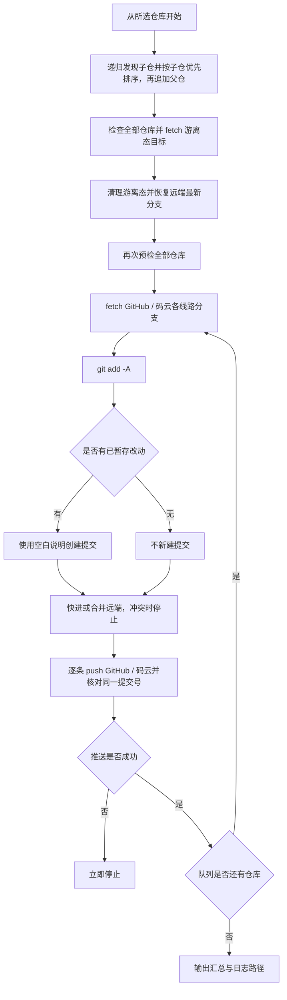

# `【MacOS@SourceTree】🚀逐层空白提交并Push.command`


[toc]

---

## 🔥 <font id=前言>前言</font>

> 用一次 [**Sourcetree**](https://www.sourcetreeapp.com/) 自定义动作，递归发现当前仓库管理的子仓，按“子仓提交、子仓推送、父仓更新 gitlink”的顺序由内向外处理，直到最外层 [**Git**](https://git-scm.com/) 仓库。

## 一、脚本用途 <a href="#前言" style="font-size:17px; color:green;"><b>🔼</b></a> <a href="#🔚" style="font-size:17px; color:green;"><b>🔽</b></a>

- 暂存当前层仓库的全部已跟踪、未跟踪和删除改动。
- 有改动时创建“提交说明为空白”的正常提交；没有改动时不制造无意义的空提交。
- 正常分支先 fetch 每条推送线路，再提交本地改动、整合全部远端历史；最后把同一个 HEAD 逐条 push，并核对各线路提交号。没有文件改动时也会同步远端和补推已有提交。
- 远端查询、fetch、push 遇到超时、空响应或连接中断时最多尝试 3 次；认证、权限、证书及推送拒绝直接停止。重试只重复该条网络命令。
- 当前层全部线路推送并核验成功后才进入父仓，使父仓提交的 gitlink 指向已经上传的子仓提交。
- 处理“当前仓库管理的全部子仓 → 当前仓库 → 上层父仓”；从子仓发起时，不扩展扫描上层的兄弟仓库。

## 二、适用场景 <a href="#前言" style="font-size:17px; color:green;"><b>🔼</b></a> <a href="#🔚" style="font-size:17px; color:green;"><b>🔽</b></a>

- 大 Git 仓库内以子模块或独立 `.git` 目录嵌套小 Git 仓库。
- 个人项目允许留空 commit message，并希望一次动作完成整条父仓链推送。
- 可以直接从大仓发起，递归提交、推送其管理的子仓；也可以从小仓发起，只处理该子树及其父仓链。

## 三、运行方式 <a href="#前言" style="font-size:17px; color:green;"><b>🔼</b></a> <a href="#🔚" style="font-size:17px; color:green;"><b>🔽</b></a>

### 3.1、Sourcetree 自定义动作 <a href="#前言" style="font-size:17px; color:green;"><b>🔼</b></a> <a href="#🔚" style="font-size:17px; color:green;"><b>🔽</b></a>

1、在要处理的大仓或小仓上打开“自定义操作”。

2、选择“🚀逐层空白提交并Push（识别父Git）”。

3、Sourcetree 传入 `$REPO` 后，脚本打开新的 Terminal.app 窗口；在终端按回车确认后执行，实时查看每层提交、GitHub / 码云推送及核验日志。

4、执行结束后终端保留日志和退出码；Sourcetree 输出只表示终端启动结果，不能用来判断推送是否成功。

### 3.2、终端独立运行 <a href="#前言" style="font-size:17px; color:green;"><b>🔼</b></a> <a href="#🔚" style="font-size:17px; color:green;"><b>🔽</b></a>

```shell
chmod +x './【MacOS@SourceTree】🚀逐层空白提交并Push.command'
'./【MacOS@SourceTree】🚀逐层空白提交并Push.command' '/path/to/repository'
```

终端模式首先展示内置自述，并等待回车确认；检测到游离态时，先逐项列出即将舍弃内容的仓库完整路径、恢复分支和本次 fetch 得到的目标提交号，再要求输入完整 `YES` 才执行清理。从 Sourcetree 打开的终端采用相同确认流程；其它输入取消恢复。

## 四、执行前检查 <a href="#前言" style="font-size:17px; color:green;"><b>🔼</b></a> <a href="#🔚" style="font-size:17px; color:green;"><b>🔽</b></a>

- 游离 HEAD 会先解析恢复分支并 fetch 最新提交；全部仓库准备成功后，才清理游离态并恢复正常分支。正常分支不执行重置。
- 每层不能存在未解决冲突、未完成的 rebase、cherry-pick、revert 或 bisect。正常分支的 merge 若冲突已全部解决并暂存，允许续跑并完成合并提交；即使最终文件内容与 HEAD 相同，也会创建必要的合并提交。
- 每层必须已配置 upstream；未配置时，脚本只在存在 `origin` 或唯一远端时自动建立关联。
- 预检会在任何 `git add` 前覆盖全部已发现的子仓、当前仓库及上层父仓；其中任意一层不满足条件，整个流程都不开始。

## 五、执行流程 <a href="#前言" style="font-size:17px; color:green;"><b>🔼</b></a> <a href="#🔚" style="font-size:17px; color:green;"><b>🔽</b></a>



## 六、风险说明 <a href="#前言" style="font-size:17px; color:green;"><b>🔼</b></a> <a href="#🔚" style="font-size:17px; color:green;"><b>🔽</b></a>

- `git add -A` 会把当前层仓库范围内的全部可跟踪改动放入同一个提交，包括新增、修改和删除。
- 正常分支采用 `各线路 fetch → 提交本地改动 → 整合各线路历史 → 各线路 push → 核对同一提交号`；落后时快进，分叉时合并，不执行 rebase 或强制推送。合并会保留双方历史，必要时新增合并提交；冲突时停止并保留本地提交及冲突现场。只有游离态恢复使用 `reset --hard` 和 `clean -fd`。
- 游离态独有提交不会合入恢复分支；未提交的已跟踪内容和非忽略的未跟踪文件会被舍弃。不会使用 `clean -x` 或双重 `-f`，忽略文件及未跟踪嵌套 Git 仓库保留；后者若阻挡切换会报错停止。
- 脚本不绕过 Git hooks，也不关闭提交签名。项目本身禁止空白提交说明时，会在该层失败并停止。
- 如果下层已经提交但 push 失败，该本地提交会保留；上层不会被继续处理。

## 七、日志文件 <a href="#前言" style="font-size:17px; color:green;"><b>🔼</b></a> <a href="#🔚" style="font-size:17px; color:green;"><b>🔽</b></a>

终端窗口实时显示进度；输出与 Git 命令结果同步写入系统临时目录中的 `【MacOS@SourceTree】🚀逐层空白提交并Push.log`。

## 八、常见问题 <a href="#前言" style="font-size:17px; color:green;"><b>🔼</b></a> <a href="#🔚" style="font-size:17px; color:green;"><b>🔽</b></a>

### 8.1、在大仓运行，能提交子仓的改动吗？ <a href="#前言" style="font-size:17px; color:green;"><b>🔼</b></a> <a href="#🔚" style="font-size:17px; color:green;"><b>🔽</b></a>

可以。脚本递归读取 Git 索引中模式为 `160000` 的 gitlink，兼容 `.git` 文件形式的子模块和 `.git` 目录形式的受管理嵌套仓。最深子仓先提交并推送，父仓随后暂存新 gitlink，直到当前大仓及其上层父仓处理完成。例如从 `JobsGenesis` 发起，会先处理 `SourceTree.command` 的文件改动，再提交大仓中的子仓指针。

未被 Git 索引登记的独立嵌套仓不自动纳入。默认跳过路径包含 `.git`、`node_modules`、`Pods`、`.dart_tool`、`build`、`DerivedData` 的子仓，并打印跳过提示；该排除仅控制子仓遍历，不改变各仓原有 `git add -A` 的暂存范围。已登记但未初始化或损坏的子仓会阻止本次执行，需先恢复工作区。

从大仓发起会处理它管理的全部非排除子仓，不限于当前有改动的子仓；干净子仓仍尝试 push。任何仓库预检失败都会在暂存前停止；执行中某仓拉取、提交、整合、推送或核验失败会停止剩余队列，已完成的提交和推送保留。

### 8.2、为什么某层没有新 commit？ <a href="#前言" style="font-size:17px; color:green;"><b>🔼</b></a> <a href="#🔚" style="font-size:17px; color:green;"><b>🔽</b></a>

该层在 `git add -A` 后没有已暂存差异。脚本仍会执行 push，用于上传本地已有的未推送提交。

### 8.3、为什么 push 后不继续外层？ <a href="#前言" style="font-size:17px; color:green;"><b>🔼</b></a> <a href="#🔚" style="font-size:17px; color:green;"><b>🔽</b></a>

该层拉取、整合、push 或远端提交号核验失败。查看日志中的冲突、鉴权、网络或 hook 信息后处理。fetch 后若远端再次被其他进程推进，push 仍可能被拒绝；重新运行会再次拉取并整合。同步成功指核验时两端分支提交一致，不意味着禁止远端以后继续产生提交。

### 8.4、为什么打印自述后立即退出，文件名还出现乱码？ <a href="#前言" style="font-size:17px; color:green;"><b>🔼</b></a> <a href="#🔚" style="font-size:17px; color:green;"><b>🔽</b></a>

旧版使用 zsh 的提示符展开 `%x` 获取脚本路径。在 `LC_ALL=C` 等非 UTF-8 环境中，中文和 Emoji 文件名会被转换成含 `\\M-` 的显示文本，创建日志文件时可能触发 `illegal byte sequence`，尚未执行 Git 操作便退出。

脚本现在直接保留 `$0` 的原始路径，并在路径解析及首行输出前设置当前进程的 UTF-8 环境；日志初始化失败会明确打印目标路径。环境识别也避免使用会提前关闭管道的 `grep -q`，以免与 `PIPE_FAIL` 组合产生误判。

若日志文件中文正常、只有 Sourcetree 输出窗口乱码，说明还需检查窗口的解码设置；子进程的 locale 不能强制改变宿主窗口的解码方式。

### 8.5、游离 HEAD 如何恢复？ <a href="#前言" style="font-size:17px; color:green;"><b>🔼</b></a> <a href="#🔚" style="font-size:17px; color:green;"><b>🔽</b></a>

优先使用父仓 `.gitmodules` 声明的子模块分支；分支为 `.` 时使用父仓当前分支。未声明时查询远端公布的默认分支，不猜测 `main` 或 `master`。远端优先选择 `origin`，不存在时要求只有一个远端；目标不明确则停止。

先检查全部仓库的冲突、未完成操作及推送条件，并对所有游离仓定向 fetch，将恢复目标固定为本次获取的提交。全部准备成功后才清理；fetch 失败不会进入清理阶段，但已成功 fetch 的远端跟踪引用会保留。

舍弃确认前，按实际执行顺序单独列出所有待恢复的游离仓库：每项显示仓库完整路径、`远端/分支` 和目标提交号，不混入正常分支仓库。该清单同时写入日志，确认范围以这份清单为准。

恢复时只处理仍处于游离态的仓库：清掉已跟踪改动和非忽略的未跟踪文件，切换到目标本地分支，并设置 upstream。不递归重置子模块；最终仍按子仓先、父仓后的顺序提交及推送。游离态独有提交不会推送，不主动清理 reflog 或 Git 对象。

目标本地分支含远端没有的提交、被其它工作树占用、忽略文件与目标路径冲突，或目标版本改变子仓目录结构时都会停止，避免覆盖正常分支历史或破坏已发现的子仓。执行中失败不自动回滚已完成的恢复；日志会保留已经恢复的仓库。

### 8.6、出现未解决冲突后怎样继续？ <a href="#前言" style="font-size:17px; color:green;"><b>🔼</b></a> <a href="#🔚" style="font-size:17px; color:green;"><b>🔽</b></a>

脚本会打印冲突文件清单，并停止暂存和推送。先按文件内容解决冲突，再用 `git add` 标记解决；重新运行即可完成待提交的合并，再继续拉取、整合和推送。脚本不自动选择本地或远端整份覆盖。仍有冲突、处于 rebase 等其它操作，或游离状态下存在未完成合并时继续停止。

### 8.7、为什么提示“无法读取远端分支”？ <a href="#前言" style="font-size:17px; color:green;"><b>🔼</b></a> <a href="#🔚" style="font-size:17px; color:green;"><b>🔽</b></a>

这是 `git ls-remote` 查询失败，不等于仓库没有分支，也不等于存在文件冲突。查询成功但返回空列表才视为远端分支尚不存在；标准错误与引用数据分开，查询失败时丢弃残余引用数据。

默认分支查询、提交前查询、fetch、push 和推送后核验统一处理短暂传输故障：`Operation timed out`、`Empty reply from server`、连接中断、域名解析失败及服务端 `500 / 502 / 503 / 504` 响应最多尝试 3 次，重试前分别等待 1 秒、2 秒。日志显示操作阶段、失败次数和退出码，恢复后明确打印成功；fetch / push 输出仍实时显示。脚本沿用现有 Git 网络配置，不修改全局代理、远端地址或证书校验。

认证、权限、证书、非快进及 hook 拒绝不属于这类传输故障，首次失败就停止。重试只重复同一条查询、fetch 或 push 命令，不重新执行暂存、提交、合并或游离态清理。push 重试仍发送同一 HEAD 与目标分支；若此前已经到达服务端，重试可能显示 `Everything up-to-date`，随后仍须读取远端提交号核验。

查询和 fetch 是独立阶段。日志先出现“远端查询失败（1/3）”，随后查询恢复成功，并不代表 fetch 也成功；应查看后面的“远端获取”阶段错误。连续网络失败会停止剩余队列，保留已经完成的仓库状态；持续网络问题仍需检查连接或代理。

### 8.8、GitHub 和码云如何同时推送？ <a href="#前言" style="font-size:17px; color:green;"><b>🔼</b></a> <a href="#🔚" style="font-size:17px; color:green;"><b>🔽</b></a>

每个仓库按自己的 remote 配置识别线路，支持 [**GitHub**](https://github.com) 与 [**码云 Gitee**](https://gitee.com)：主上游的全部 push URL 始终纳入；其它远端的地址指向 `github.com` / `gitee.com`，或远端名为 `github` / `gitee` 时也纳入。相同地址去重，无关远端不会自动推送。也支持一个 remote 配置多个 push URL。

两边使用主上游配置的目标分支名（未配置时使用当前本地分支名），不会向码云默认分支猜测推送。只有一条已配置线路的子仓继续单线运行；脚本不会猜测、创建码云仓库或自动添加远端。可在目标仓库配置：

```shell
git remote add gitee git@gitee.com:你的账号/你的仓库.git
```

全部线路先获取、再整合，最后逐条推送相同 HEAD。远端分支不存在时首次创建；存在独立且无共同祖先的历史时停止，需人工处理。任一线路失败停止父仓，已经成功的推送保留，修复后重跑。不会强推，也不会把当前分支的 upstream 改成第二条线路。获取的历史保存在 `refs/jobs-push-sync/` 下，供本次合并使用。

### 8.9、Sourcetree 为什么只显示终端启动结果？ <a href="#前言" style="font-size:17px; color:green;"><b>🔼</b></a> <a href="#🔚" style="font-size:17px; color:green;"><b>🔽</b></a>

Sourcetree 动作现在只负责打开 Terminal.app；实际 Git 流程在独立终端中执行，避免等待 Sourcetree 输出窗口刷新。终端先展示影响范围并等待回车，执行时持续输出日志，结束后显示退出码（`0` 为成功），窗口保持打开。按 `Ctrl+C` 可中止正在执行的流程。

首次打开可能出现 macOS 自动化授权，需允许启动进程控制 Terminal.app。启动失败会直接报错，不在 Sourcetree 后台继续提交或推送；可改用终端直接运行同一个脚本。

<a id="🔚" href="#前言" style="font-size:17px; color:green; font-weight:bold;">我是有底线的➤点我回到首页</a>
