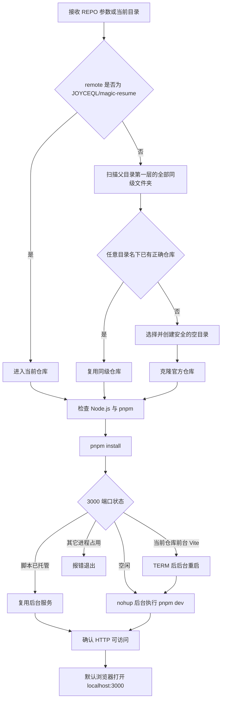

# `配置并运行 Magic Resume`


[toc]

---

## 🔥 <font id=前言>前言</font>

> 该脚本用于从 [**Sourcetree**](https://www.sourcetreeapp.com/) 一键校验、准备并运行 [**JOYCEQL/magic-resume**](https://github.com/JOYCEQL/magic-resume)。开发服务器会脱离终端在后台运行，关闭 Sourcetree 输出窗口或终端不会停止服务。

## 一、适用场景 <a href="#前言" style="font-size:17px; color:green;"><b>🔼</b></a> <a href="#🔚" style="font-size:17px; color:green;"><b>🔽</b></a>

- 当前 Sourcetree 仓库就是 `JOYCEQL/magic-resume`：直接进入当前仓库配置并运行。

- 当前 Sourcetree 仓库不是目标仓库：先扫描当前仓库父目录下的全部平级文件夹，找到任意目录名但 remote 匹配的官方仓库就直接复用；全部找不到才创建空目录并克隆。

- 希望运行 `pnpm dev` 后立即关闭终端：脚本通过 `nohup`、断开标准输入并脱离 zsh 作业控制启动后台服务。

## 二、行为边界 <a href="#前言" style="font-size:17px; color:green;"><b>🔼</b></a> <a href="#🔚" style="font-size:17px; color:green;"><b>🔽</b></a>

### 2.1、仓库识别 <a href="#前言" style="font-size:17px; color:green;"><b>🔼</b></a> <a href="#🔚" style="font-size:17px; color:green;"><b>🔽</b></a>

- 支持 `https://github.com/JOYCEQL/magic-resume.git`、`git@github.com:JOYCEQL/magic-resume.git` 等常见 HTTPS / SSH remote 写法。

- 会检查仓库的全部 remote，不要求 remote 必须命名为 `origin`。

- 当前仓库不匹配时，先扫描父目录第一层的全部同级文件夹；候选目录名不限，但候选自身必须是 Git 仓库根目录，并且至少一个 remote 指向 `JOYCEQL/magic-resume`。

- 已有同级官方仓库时立即切换并复用，不创建任何新目录。只有全部同级目录均未命中时，才选择 `magic-resume`、`magic-resume-JOYCEQL` 等安全候选创建空目录。

- 只会复用 remote 正确的 Git 仓库或完全空的文件夹；不会覆盖、清空或改写已有非空目录。

### 2.2、环境和依赖 <a href="#前言" style="font-size:17px; color:green;"><b>🔼</b></a> <a href="#🔚" style="font-size:17px; color:green;"><b>🔽</b></a>

- 需要 macOS 自带的 `git`、`curl`、`lsof`、`nohup` 和 `open`。

- 优先复用现有 [**Node.js**](https://nodejs.org) 与 [**pnpm**](https://pnpm.io/)；缺少 Node.js 时只通过已经安装的 [**Homebrew**](https://brew.sh/) 补齐，不会自动安装 Homebrew。

- 缺少 pnpm 时，通过 `npm install --global` 安装项目 `package.json` 声明的 pnpm 版本。

- 按官方快速开始执行 `pnpm install` 和 `pnpm dev`，不自动执行 `git pull`、依赖升级、构建或部署。

### 2.3、后台服务 <a href="#前言" style="font-size:17px; color:green;"><b>🔼</b></a> <a href="#🔚" style="font-size:17px; color:green;"><b>🔽</b></a>

- `pnpm dev` 的标准输入会断开，输出写入系统临时目录中的 `【MacOS@SourceTree】🪄配置并运行Magic Resume-dev.log`。

- 3000 端口的实际监听进程 PID 写入系统临时目录中的 `【MacOS@SourceTree】🪄配置并运行Magic Resume-dev.pid`。

- 如果 3000 端口由本脚本 PID 文件记录的当前仓库后台进程监听，直接复用。

- 如果 3000 端口属于当前仓库未托管的 Vite dev，脚本只向该监听进程发送普通 `TERM`，等端口释放后重新后台启动；不会使用强制结束信号。

- 如果 3000 端口属于其它目录或无法确认为 Vite dev，脚本报错退出，避免误停进程或打开错误页面。

- 服务就绪后调用系统默认浏览器打开 `http://localhost:3000`，随后脚本退出，后台服务继续运行。

## 三、运行方式 <a href="#前言" style="font-size:17px; color:green;"><b>🔼</b></a> <a href="#🔚" style="font-size:17px; color:green;"><b>🔽</b></a>

### 3.1、Sourcetree 自定义动作 <a href="#前言" style="font-size:17px; color:green;"><b>🔼</b></a> <a href="#🔚" style="font-size:17px; color:green;"><b>🔽</b></a>

1、打开 Sourcetree 的“偏好设置 → 自定义操作”。

2、脚本目标选择当前目录中的 `./【MacOS@SourceTree】🪄配置并运行Magic Resume.command`。

3、参数填写 `$REPO`，并开启完整输出，便于查看安装与启动状态。

4、在任意仓库中执行该自定义动作。Sourcetree 模式会打印内置自述，但不会等待键盘输入。

### 3.2、系统终端 <a href="#前言" style="font-size:17px; color:green;"><b>🔼</b></a> <a href="#🔚" style="font-size:17px; color:green;"><b>🔽</b></a>

- 传入当前 Git 仓库：

  ```shell
  './【MacOS@SourceTree】🪄配置并运行Magic Resume.command' '/path/to/current-repository'
  ```

- 不传参数时，脚本优先识别当前目录；无法识别时提示拖入 Git 仓库目录。终端模式会先等待回车确认。

## 四、执行流程 <a href="#前言" style="font-size:17px; color:green;"><b>🔼</b></a> <a href="#🔚" style="font-size:17px; color:green;"><b>🔽</b></a>



## 五、日志与停止服务 <a href="#前言" style="font-size:17px; color:green;"><b>🔼</b></a> <a href="#🔚" style="font-size:17px; color:green;"><b>🔽</b></a>

- 业务日志位于系统临时目录中的 `【MacOS@SourceTree】🪄配置并运行Magic Resume.log`。

- 开发服务器日志位于系统临时目录中的 `【MacOS@SourceTree】🪄配置并运行Magic Resume-dev.log`。

- 查看 PID：

  ```shell
  cat "$TMPDIR/【MacOS@SourceTree】🪄配置并运行Magic Resume-dev.pid"
  ```

- 停止由脚本启动的服务：

  ```shell
  kill "$(cat "$TMPDIR/【MacOS@SourceTree】🪄配置并运行Magic Resume-dev.pid")"
  ```

  执行 `kill` 前先使用 `ps -p PID -o command=` 核对进程，避免临时 PID 文件过期后误停其它进程。

## 六、风险说明 <a href="#前言" style="font-size:17px; color:green;"><b>🔼</b></a> <a href="#🔚" style="font-size:17px; color:green;"><b>🔽</b></a>

- `git clone` 只写入新建或已确认完全为空的同级目录；克隆失败时保留现场，不自动删除非空残留。

- `pnpm install` 会写入项目依赖目录，并可能在上游清单与锁文件不一致时更新锁文件；执行前先确认当前仓库状态。

- 后台服务不会随终端关闭自动结束，需要按 PID 主动停止，或通过 `lsof -nP -iTCP:3000 -sTCP:LISTEN` 找到监听进程后核对并停止。

- 为满足“终端可关闭”，当前仓库已有但未被 PID 文件标记为脚本托管的 Vite dev 会先收到 `TERM`，再由脚本后台重启；其它类型进程不会被自动停止。

## 七、常见问题 <a href="#前言" style="font-size:17px; color:green;"><b>🔼</b></a> <a href="#🔚" style="font-size:17px; color:green;"><b>🔽</b></a>

### 7.1、为什么没有创建新的同级目录？ <a href="#前言" style="font-size:17px; color:green;"><b>🔼</b></a> <a href="#🔚" style="font-size:17px; color:green;"><b>🔽</b></a>

当前仓库已经是官方仓库，或父目录第一层的任意名称文件夹中已经存在 remote 正确的官方仓库时，不重复创建和克隆。

### 7.2、为什么没有再次启动 `pnpm dev`？ <a href="#前言" style="font-size:17px; color:green;"><b>🔼</b></a> <a href="#🔚" style="font-size:17px; color:green;"><b>🔽</b></a>

只有 3000 端口监听 PID 与脚本 PID 文件一致时才直接复用。当前仓库手工前台启动的 Vite 会被安全停止并转为后台运行，确保关闭终端后仍可访问。

### 7.3、为什么提示 3000 端口被其它目录占用？ <a href="#前言" style="font-size:17px; color:green;"><b>🔼</b></a> <a href="#🔚" style="font-size:17px; color:green;"><b>🔽</b></a>

脚本不会结束未知进程，也不会让 Vite 自动漂移到其它端口。先核对并处理占用者，再重新运行脚本。

### 7.4、关闭终端后页面是否还能访问？ <a href="#前言" style="font-size:17px; color:green;"><b>🔼</b></a> <a href="#🔚" style="font-size:17px; color:green;"><b>🔽</b></a>

能。由该脚本新启动的服务已经通过 `nohup` 脱离终端；只要后台进程没有被主动停止，`http://localhost:3000` 就会继续提供服务。

<a id="🔚" href="#前言" style="font-size:17px; color:green; font-weight:bold;">我是有底线的➤点我回到首页</a>
