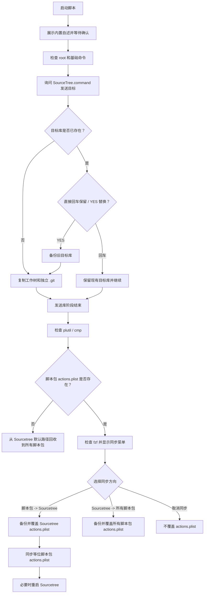

# `【MacOS】安装SourceTree自定义菜单.command`


[toc]

---

## 🔥 <font id=前言>前言</font>

- `【MacOS】安装SourceTree自定义菜单.command` 用于先发送 `SourceTree.command` 库，再维护 [**Sourcetree**](https://www.sourcetreeapp.com/) 自定义操作菜单的 `actions.plist`。
- 第一阶段会把当前 `SourceTree.command` 库复制到目标目录。默认目标父目录是脚本运行时的 `$HOME`，也就是当前用户家目录；可以手动拖入或输入其它目录。
- 第二阶段会先检查脚本包内是否已有 `actions.plist`：已有时使用 [**fzf**](https://formulae.brew.sh/formula/fzf) 选择同步方向；没有时自动从 Sourcetree 默认配置路径回收到脚本包目录，文件名仍为 `actions.plist`。

## 一、适用场景 <a href="#前言" style="font-size:17px; color:green;"><b>🔼</b></a> <a href="#🔚" style="font-size:17px; color:green;"><b>🔽</b></a>

- 需要把当前 `SourceTree.command` 库发送到当前用户家目录下，形成 `~/SourceTree.command`。
- 需要把 `SourceTree.command` 连同 Git 元数据一起带过去，让目标目录具备独立 `.git`。
- 已经维护好脚本包内 `actions.plist`，需要写入 Sourcetree 当前用户配置。
- 脚本包内还没有 `actions.plist`，需要从 Sourcetree 默认配置路径自动回收一份。
- 在 Sourcetree 里手动调整了自定义操作，需要把当前配置同步回脚本包。
- 需要保持多个等位脚本包里的 `actions.plist` 一致。

## 二、运行方式 <a href="#前言" style="font-size:17px; color:green;"><b>🔼</b></a> <a href="#🔚" style="font-size:17px; color:green;"><b>🔽</b></a>

- 双击运行：

  ```text
  【MacOS】安装SourceTree自定义菜单.command
  ```

- 终端运行：

  ```shell
  zsh './【MacOS】安装SourceTree自定义菜单.command'
  ```

- 脚本会先展示内置自述，按回车后才进入真实业务。
- 不要使用 `sudo` 执行，避免把配置写入 `root 用户家目录`。

## 三、发送库阶段 <a href="#前言" style="font-size:17px; color:green;"><b>🔼</b></a> <a href="#🔚" style="font-size:17px; color:green;"><b>🔽</b></a>

- 脚本会先询问目标目录：

  ```text
  请输入或拖入目标目录（直接回车使用 $HOME）
  ```

- 直接回车时，脚本会把当前 `SourceTree.command` 发送到：

  ```text
  ~/SourceTree.command
  ```

- 如果输入的是普通父目录，脚本会在该目录下生成 `SourceTree.command`。
- 如果输入的路径本身已经叫 `SourceTree.command`，脚本会把它当成最终目标路径。
- 如果目标库已经存在，直接回车会保留现有 `SourceTree.command`，并继续进入 Sourcetree 自定义菜单安装流程。
- 如果目标库已经存在且输入 `YES` 后回车，脚本会把旧目录改名为：

  ```text
  SourceTree.command.bak.年月日_时分秒
  ```

- 源库如果是子 Git，脚本会把真实 Git 目录复制成目标库里的独立 `.git`，避免只复制 `.git` 指针后目标目录不可用。

## 四、安装菜单阶段 <a href="#前言" style="font-size:17px; color:green;"><b>🔼</b></a> <a href="#🔚" style="font-size:17px; color:green;"><b>🔽</b></a>

- 库发送阶段结束后，脚本才会进入 Sourcetree 自定义菜单安装流程。
- 如果脚本包内没有 `actions.plist`，脚本会跳过 [**fzf**](https://formulae.brew.sh/formula/fzf) 选择，直接从默认路径 `~/Library/Application Support/SourceTree/actions.plist` 备份到各等位脚本包目录，文件名仍为 `actions.plist`。
- 如果脚本包内已经存在 `actions.plist`，[**fzf**](https://formulae.brew.sh/formula/fzf) 菜单会提供三个选项：

  ```text
  将脚本包 actions.plist 同步到 Sourcetree 当前用户配置
  将 Sourcetree 当前用户配置同步回所有脚本包 actions.plist
  取消同步
  ```

- 同步方向说明：

  | 菜单项 | 源文件 | 目标文件 |
  | --- | --- | --- |
  | `将脚本包 actions.plist 同步到 Sourcetree 当前用户配置` | 当前脚本包内 `actions.plist` | `~/Library/Application Support/SourceTree/actions.plist` |
  | `将 Sourcetree 当前用户配置同步回所有脚本包 actions.plist` | `~/Library/Application Support/SourceTree/actions.plist` | 各等位脚本包内 `actions.plist` |
  | `取消同步` | 不读取覆盖源 | 不覆盖目标 |

- 从脚本包同步到 Sourcetree 时，如果 Sourcetree 正在运行，脚本会尝试重启 Sourcetree 让菜单重新加载。
- 选择 `取消同步` 或在 [**fzf**](https://formulae.brew.sh/formula/fzf) 中按 Esc 时，脚本只结束流程，不覆盖任何 `actions.plist`，也不重启 Sourcetree。

## 五、执行前检查 <a href="#前言" style="font-size:17px; color:green;"><b>🔼</b></a> <a href="#🔚" style="font-size:17px; color:green;"><b>🔽</b></a>

- 当前用户需要能写入目标父目录。
- 当前用户需要能写入 Sourcetree 配置目录：

  ```text
  ~/Library/Application Support/SourceTree/actions.plist
  ```

- 系统必须能找到 `git`、`ditto`、`plutil` 和 `cmp`。
- 只有脚本包内已经存在 `actions.plist`、需要进入同步方向选择时，才需要 [**fzf**](https://formulae.brew.sh/formula/fzf)；如果缺少 `fzf`，可以先安装：

  ```shell
  brew install fzf
  ```

- 当前脚本目录没有 `actions.plist` 时，脚本会从 Sourcetree 默认配置路径自动回收；默认路径也缺失时才会报错退出。

## 六、流程图 <a href="#前言" style="font-size:17px; color:green;"><b>🔼</b></a> <a href="#🔚" style="font-size:17px; color:green;"><b>🔽</b></a>



## 七、风险说明 <a href="#前言" style="font-size:17px; color:green;"><b>🔼</b></a> <a href="#🔚" style="font-size:17px; color:green;"><b>🔽</b></a>

- 发送库阶段可能替换目标目录下的 `SourceTree.command`；目标已存在时，直接回车会继续后续菜单安装但不替换目标库。
- 只有输入 `YES` 后回车，脚本才会备份并替换已有目标库。
- 替换目标库前会备份旧目录，不会直接删除旧目录。
- 脚本包缺少 `actions.plist` 时，只会从 Sourcetree 默认配置路径单向回收到脚本包，不会进入 [**fzf**](https://formulae.brew.sh/formula/fzf) 选择。
- 两个 `actions.plist` 同步方向都会覆盖目标文件，但覆盖前会自动备份；选择取消同步不会覆盖任何 `actions.plist`。
- 脚本不会创建提交，不会推送远端，也不会主动切换 Git 分支。

## 八、日志文件 <a href="#前言" style="font-size:17px; color:green;"><b>🔼</b></a> <a href="#🔚" style="font-size:17px; color:green;"><b>🔽</b></a>

- 日志会同步写入系统临时目录中的：

  ```text
  $TMPDIR/【MacOS】安装SourceTree自定义菜单.log
  ```

- 失败时优先查看日志中的 `✖` 错误信息。

## 九、常见问题 <a href="#前言" style="font-size:17px; color:green;"><b>🔼</b></a> <a href="#🔚" style="font-size:17px; color:green;"><b>🔽</b></a>

- 如果目标库已经存在但不想替换，直接回车即可，脚本会保留现有目标库并继续进入菜单安装流程。
- 如果运行后目标库不是 Git 仓库，确认源 `SourceTree.command` 是否本身带有可读取的 Git 元数据。
- 如果 Sourcetree 菜单没有刷新，手动退出并重新打开 Sourcetree。
- 如果 `fzf` 菜单无法打开，请确认终端是可交互环境，并且 `fzf` 已安装。

<a id="🔚" href="#前言" style="font-size:17px; color:green; font-weight:bold;">我是有底线的➤点我回到首页</a>
