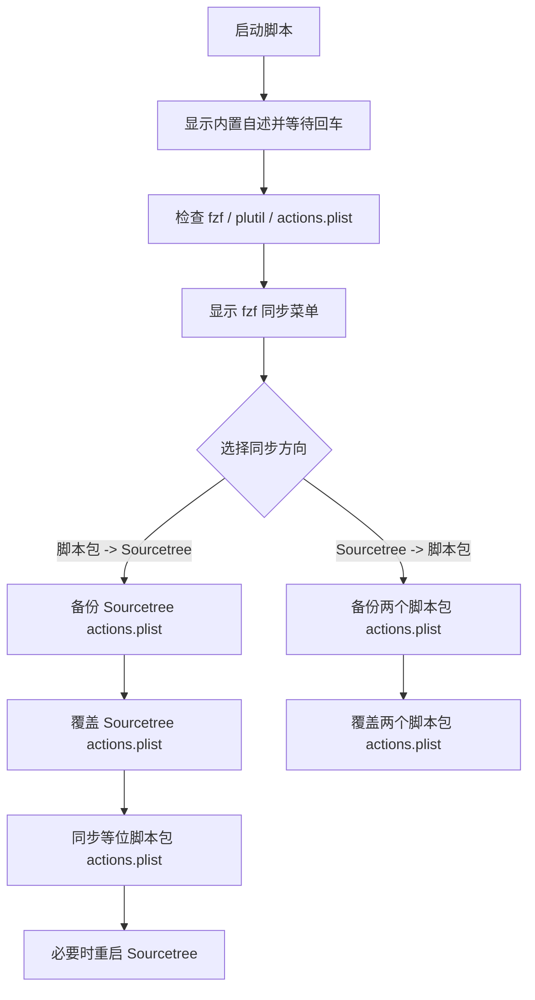

# `【MacOS】安装SourceTree自定义菜单.command`


[toc]

---

## 🔥 <font id=前言>前言</font>

`【MacOS】安装SourceTree自定义菜单.command` 用于维护 [**Sourcetree**](https://www.sourcetreeapp.com/) 自定义操作菜单的 `actions.plist`。

脚本启动后会使用 [**fzf**](https://formulae.brew.sh/formula/fzf) 显示同步菜单，让你明确选择同步方向：

```text
将目前的actions.plist同步至sourcetree里面
将目前sourcetree里面的配置同步至actions.plist里面
```

所有覆盖动作都会先备份目标文件，备份文件格式为：

```text
actions.plist.bak.年月日_时分秒
```

---

## 一、适用场景 <a href="#前言" style="font-size:17px; color:green;"><b>🔼</b></a> <a href="#🔚" style="font-size:17px; color:green;"><b>🔽</b></a>

- 已经维护好脚本包内 `actions.plist`，需要写入 Sourcetree 当前用户配置。
- 在 Sourcetree 里手动调整了自定义操作，需要把当前配置同步回脚本包。
- 需要保持下面两个等位脚本包的 `actions.plist` 一致：

  ```text
  ~/SourceTree.command/【MacOS】安装SourceTree自定义菜单.command/actions.plist
  ./actions.plist
  ```

---

## 二、执行前检查 <a href="#前言" style="font-size:17px; color:green;"><b>🔼</b></a> <a href="#🔚" style="font-size:17px; color:green;"><b>🔽</b></a>

- 不要使用 `sudo` 执行，避免把配置写入 `root 用户家目录`。
- 当前用户需要能写入 Sourcetree 配置目录：

  ```text
  ~/Library/Application Support/SourceTree/actions.plist
  ```

- 系统必须能找到 `fzf`：

  ```shell
  brew install fzf
  ```

- 当前脚本目录必须存在合法的 `actions.plist`。

---

## 三、运行方式 <a href="#前言" style="font-size:17px; color:green;"><b>🔼</b></a> <a href="#🔚" style="font-size:17px; color:green;"><b>🔽</b></a>

### 3.1、双击运行

在 Finder 中双击：

```text
【MacOS】安装SourceTree自定义菜单.command
```

脚本会先显示内置自述，按回车后进入 `fzf` 菜单。

### 3.2、终端运行

```shell
zsh "./【MacOS】安装SourceTree自定义菜单.command"
```

---

## 四、同步方向说明 <a href="#前言" style="font-size:17px; color:green;"><b>🔼</b></a> <a href="#🔚" style="font-size:17px; color:green;"><b>🔽</b></a>

| 菜单项 | 源文件 | 目标文件 |
| --- | --- | --- |
| `将目前的actions.plist同步至sourcetree里面` | 当前脚本包内 `actions.plist` | `~/Library/Application Support/SourceTree/actions.plist` |
| `将目前sourcetree里面的配置同步至actions.plist里面` | `~/Library/Application Support/SourceTree/actions.plist` | 两个等位脚本包内 `actions.plist` |

当从脚本包同步到 Sourcetree 时，脚本会在发生覆盖后尝试重启正在运行的 Sourcetree，让菜单重新加载。

---

## 五、流程图 <a href="#前言" style="font-size:17px; color:green;"><b>🔼</b></a> <a href="#🔚" style="font-size:17px; color:green;"><b>🔽</b></a>



---

## 六、风险说明 <a href="#前言" style="font-size:17px; color:green;"><b>🔼</b></a> <a href="#🔚" style="font-size:17px; color:green;"><b>🔽</b></a>

- 两个同步方向都会覆盖目标 `actions.plist`，但覆盖前会自动备份。
- 如果 Sourcetree 正在运行，配置写入后需要重启才能重新加载菜单。
- 脚本不会删除业务 `.command` 文件夹，也不会修改 Git 分支、提交或远程仓库。

---

## 七、日志文件 <a href="#前言" style="font-size:17px; color:green;"><b>🔼</b></a> <a href="#🔚" style="font-size:17px; color:green;"><b>🔽</b></a>

日志路径：

```text
$TMPDIR/【MacOS】安装SourceTree自定义菜单.log
```

失败时优先查看日志中的 `✖` 错误信息。

<a id="🔚" href="#前言" style="font-size:17px; color:green; font-weight:bold;">我是有底线的➤点我回到首页</a>
